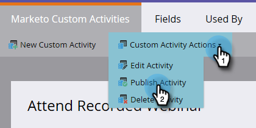
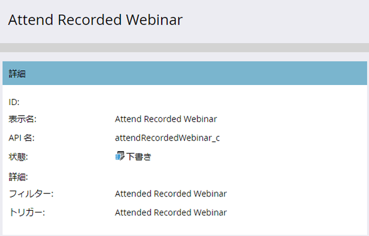

# カスタムアクティビティの公開 {#publish-a-custom-activity}

カスタムアクティビティは、必要に応じて用意されています。 さあ、それを公開する時だ！

1. 「 **管理者**」をクリックします。

   

1. 「 **Database Management** 」で、「 **Markettoカスタムアクティビティ**」をクリックします。

   

1. 公開するカスタムアクティビティを選択します。

   

1. 「 **カスタムアクティビティアクション** 」ドロップダウンをクリックし、「 **公開アクティビティ**」を選択します。

   

   カスタムアクティビティの状態がドラフトから移行したことがわかります。

   

   ...発行済み。

   

   うまくいった！

