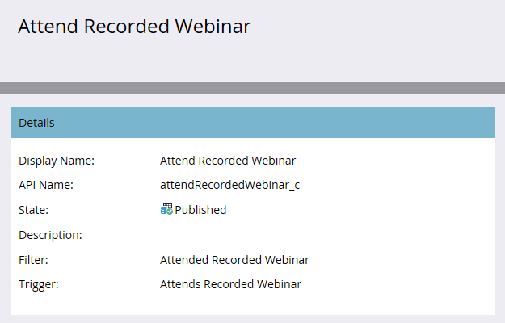

# カスタムアクティビティの公開 {#publish-a-custom-activity}

カスタムアクティビティを公開する方法を説明します。

1. 「**[!UICONTROL 管理者]**」領域に移動します。

   

1. 「**[!UICONTROL Marketo カスタムアクティビティ]**」をクリックします。

   

1. 公開するカスタムアクティビティを選択します。

   

1. **[!UICONTROL カスタムアクティビティアクション]**&#x200B;ドロップダウンをクリックして、**[!UICONTROL アクティビティを公開]**&#x200B;を選択します。

   

   カスタムアクティビティの[!UICONTROL 状態]が[!UICONTROL &#x200B; ドラフト &#x200B;]から変更されました…

   

   ...[!UICONTROL 公開済み]に変更されました。

   
