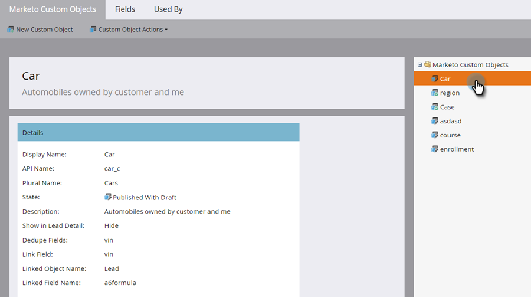
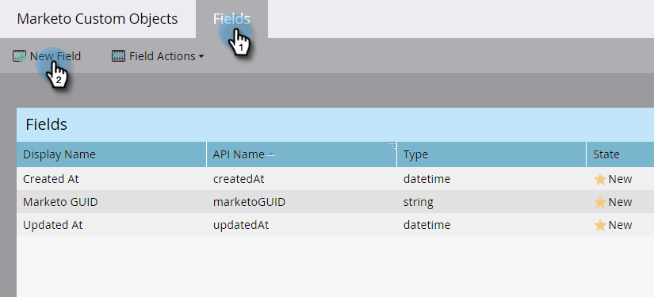
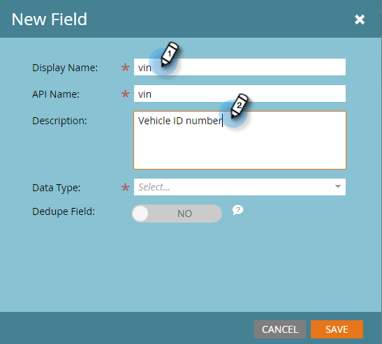
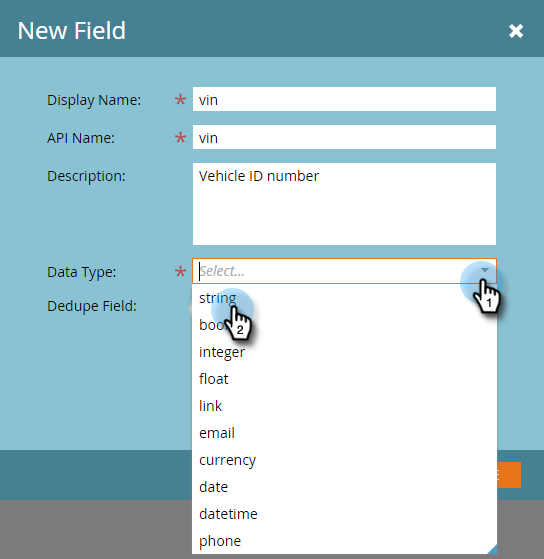

# Marketo カスタムオブジェクトフィールドの追加 {#add-marketo-custom-object-fields}

カスタムオブジェクトを作成したら、ビジネス上のニーズに合うように、そこにフィールドを追加する必要があります。

フィールドでは、カスタムオブジェクトによって使用される特定の情報が定義されます。リンクフィールドには、カスタムオブジェクトを結び付けるという特別な機能があります。これについては、[別のページ](/help/marketo/product-docs/administration/marketo-custom-objects/add-marketo-custom-object-link-fields.md)で説明しています。

1. 「**[!UICONTROL 管理者]**」領域に移動します。

   

1. 「**[!UICONTROL Marketo カスタムオブジェクト]**」をクリックします。

   

1. 右側でフィールドを追加するオブジェクトを選択します。

   

1. 「**[!UICONTROL フィールド]**」タブをクリックして、「**[!UICONTROL 新規フィールド]**」をクリックします。

   

   >[!NOTE]
   >
   >上記の 3 つのフィールドは、カスタムオブジェクトの作成時に Marketo によって自動的に作成されます。Marketo はこれらのフィールドを自動的に管理するので、編集や削除はできません。

1. [!UICONTROL 表示名]と（オプションで）[!UICONTROL 説明]を入力します。

   

   >[!NOTE]
   >
   >API 名は、一度承認されると編集できません。

1. 次に、リストから適切な[!UICONTROL データタイプ]を選択します。

   

1. 新しいフィールドを一意の識別子として使用する場合は、[!UICONTROL 重複排除]スライダーをオンにします。「**[!UICONTROL 保存]**」をクリックして終了します。

   

   >[!TIP]
   >
   >重複排除フィールドは、カスタムオブジェクトの取得、更新、削除に使用できます。すべてのカスタムオブジェクト定義には、重複排除フィールドを少なくとも 1 つ含める必要があります（3 つまで）。

1. 必要なその他のフィールドを追加します。

   >[!NOTE]
   >
   >1 対多の構造を構築する場合は、カスタムオブジェクトにリンクフィールドを追加する必要があります。多対多の構造の場合、カスタムオブジェクトにリンクフィールドは必要ありませんが、中間オブジェクトに 2 つのリンクフィールドを追加する必要があります。Marketo カスタムオブジェクトのタイプについて詳しくは、[カスタムオブジェクトリンクフィールドの追加](/help/marketo/product-docs/administration/marketo-custom-objects/add-marketo-custom-object-fields.md)を参照してリンクフィールドを作成し、[Marketo カスタムオブジェクトについて](/help/marketo/product-docs/administration/marketo-custom-objects/understanding-marketo-custom-objects.md)を参照してください。

>[!MORELIKETHIS]
>
>* [Marketo カスタムオブジェクトリンクフィールドの追加](/help/marketo/product-docs/administration/marketo-custom-objects/add-marketo-custom-object-link-fields.md)
>* [Marketo カスタムオブジェクトの編集と削除](/help/marketo/product-docs/administration/marketo-custom-objects/edit-and-delete-a-marketo-custom-object.md)
>* [Marketo カスタムオブジェクトフィールドの編集と削除](/help/marketo/product-docs/administration/marketo-custom-objects/edit-and-delete-marketo-custom-object-fields.md)
>* [Marketo カスタムオブジェクトについて](/help/marketo/product-docs/administration/marketo-custom-objects/understanding-marketo-custom-objects.md)
