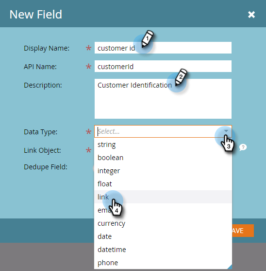

# Marketo カスタムオブジェクトリンクフィールドの追加 {#add-marketo-custom-object-link-fields}

カスタムオブジェクトを作成する場合は、カスタムオブジェクトレコードを正しい親レコードに接続するためのリンクフィールドを指定する必要があります。

* 1 対多のカスタム構造の場合は、カスタムオブジェクトのリンクフィールドを使用して、カスタム構造を個人または会社に接続します。
* 多対多構造の場合は、2 つのリンクフィールドを使用し、別に作成した中間オブジェクト（カスタムオブジェクトの一種でもある）から接続します。1 つのリンクはデータベース内の人や会社に接続し、もう 1 つのリンクはカスタムオブジェクトに接続します。この場合、リンクフィールドはカスタムオブジェクト自体に配置されません。

## 1 対多構造のリンクフィールドの作成 {#create-a-link-field-for-a-one-to-many-structure}

次に、1 対多の構造のカスタムオブジェクトにリンクフィールドを作成する方法を示します。

1. 「**管理者**」領域に移動します。

   

1. 「**Marketo カスタムオブジェクト**」をクリックします。

   

1. リストからカスタムオブジェクトを選択します。

   

1. 「**フィールド**」タブで、「**新規フィールド**」をクリックします。

   

1. リンクフィールドに名前を付け、オプションで説明を追加します。必ず「リンク」データタイプを選択してください。

   

   >[!CAUTION]
   >
   >カスタムオブジェクトが承認されると、リンクフィールドや重複排除フィールドの作成、編集、削除に戻ることはできません。

1. リンクオブジェクトの対象をリード（個人）か会社かを選択します。

   

   >[!NOTE]
   >
   >「リード」を選択すると、ID、メールアドレスおよびリスト内のカスタムフィールドが表示されます。
   >
   >「会社」を選択した場合、ID とカスタムフィールドがリストに表示されます。

1. 新しいフィールドの親として接続するリンクフィールドを選択します。

   

   >[!NOTE]
   >
   >リンクフィールドでは、文字列フィールドタイプのみがサポートされています。

1. 「**保存**」をクリックします。

   

## 多対多構造のリンクフィールドの作成 {#create-a-link-field-for-a-many-to-many-structure}

次に、多対多構造で使用するリンクフィールドを中間オブジェクトに作成する方法を示します。

>[!PREREQUISITES]
>
>既に中間オブジェクトと、その中間オブジェクトをリンクするカスタムオブジェクトを作成している必要があります。

1. 「**管理者**」領域に移動します。

   

1. 「**Marketo カスタムオブジェクト**」をクリックします。

   

1. フィールドを追加する中間オブジェクトを選択します。

   

1. 「**フィールド**」タブで、「**新規フィールド**」をクリックします。

   

1. 2 つのリンクフィールドを作成する必要があります。一度に 1 つずつ作成します。まず、データベースリストのメンバーのフィールドに名前を付けます（例：leadID）。オプションで説明を追加します。必ず「リンク」データタイプを選択してください。

   

   >[!CAUTION]
   >
   >カスタムオブジェクトが承認されると、リンクフィールドや重複排除フィールドの作成、編集、削除に戻ることはできません。

1. データベースからリンクオブジェクト（この場合は「リード」）を選択します。

   

1. 接続するリンクフィールド（この場合は ID）を選択します。

   

   >[!NOTE]
   >
   >リンクフィールドでは、文字列フィールドタイプのみがサポートされています。

1. 「**保存**」をクリックします。

   

1. カスタムオブジェクトへの 2 番目のリンク（この例では courseID）に対して、この手順を繰り返します。「リンクオブジェクト名」は「コース」、「リンクフィールド」は「courseID」になります。既にコースのカスタムオブジェクトを作成し承認しているので、これらの選択はドロップダウンメニューで使用できます。

   

1. 「enrollmentID」や「成績」など、中間オブジェクトで使用するその他のフィールドを作成します。

## カスタムオブジェクトの使用 {#using-custom-objects}

次の手順では、スマートキャンペーンのフィルターでこれらのカスタムオブジェクトを使用します。多対多の関係では、複数の人／会社および複数のカスタムオブジェクトを選択できます。以下の例では、データベース内でこれらの条件に一致する人がすべて表示されます。「コース名」フィールドはコースカスタムオブジェクトから、「登録成績」は中間オブジェクトから取得されます。

>[!MORELIKETHIS]
>
>* [Marketo カスタムオブジェクトフィールドの追加](/help/marketo/product-docs/administration/marketo-custom-objects/add-marketo-custom-object-fields.md)
>* [Marketo カスタムオブジェクトの編集と削除](/help/marketo/product-docs/administration/marketo-custom-objects/edit-and-delete-a-marketo-custom-object.md)
>* [Marketo カスタムオブジェクトについて](/help/marketo/product-docs/administration/marketo-custom-objects/understanding-marketo-custom-objects.md)
>* [Marketo カスタムオブジェクトフィールドの編集と削除](/help/marketo/product-docs/administration/marketo-custom-objects/edit-and-delete-marketo-custom-object-fields.md)

