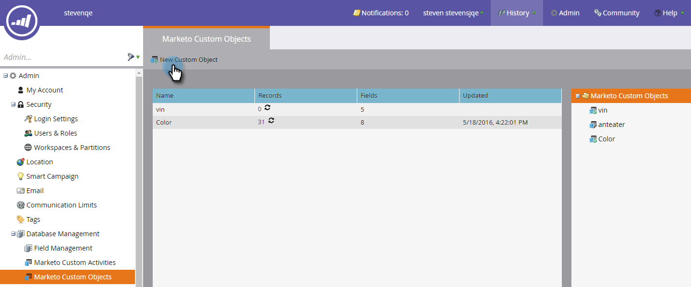

# マーケティングカスタムオブジェクトの作成{#create-marketo-custom-objects}

Marketingのカスタムオブジェクトを使用して、ビジネスに固有の指標を追跡します。 これは、車からコースまで、キャンペーンを運営するためにMarketoでモデル化したいものであれば何でもかまいません。

>[!NOTE]
>
>1対多または多対多で動作するカスタムオブジェクトを設定できます。 最初のオブジェクトの作成方法も同じですが、フィールドをオブジェクトに追加する開始の場合は手順が異なります。 詳しくは、[マーケティングカスタムオブジェクトについて](understanding-marketo-custom-objects.md)を参照してください。

>[!NOTE]
>
>カスタムオブジェクトが承認された後は、リンクまたは重複除外フィールドの作成、編集、削除はできません。

## 1対多構造体用のカスタムオブジェクトの作成{#create-a-custom-object-for-a-one-to-many-structure}

次の例は、1対多の構造に使用するCarカスタムオブジェクトを示しています。 後で、コースカスタムオブジェクトと、多対多の構造に使用する中間オブジェクトを作成します。

1. 「**管理者**」をクリックし、「**データベース管理**」で「**マーケティング先カスタムオブジェクト**」を選択します。

   ** 

   **

1. 「**新しいカスタムオブジェクト**」をクリックします。

   

   >[!NOTE]
   >
   >「マーケティングカスタムオブジェクト」タブでは、右側にすべてのカスタムオブジェクトと、最新の更新時のレコード数やフィールド数など、承認済みのオブジェクトの詳細が表示されます。

1. 表示名を入力します。 API名と複数名は自動的に入力されます。 説明を入力します（オプション）。

   

   >[!NOTE]
   >
   >これらのフィールドは、作成時に編集できますが、保存後は、複数名フィールドと&#x200B;**リードの詳細に表示**&#x200B;スライダのみを編集できます。

1. 「**Show in Lead Detail **slider over」を引き、「Lead Database」ページにカスタムオブジェクトデータを表示したい場合は、「**Show**」と表示します。 「**保存**」をクリックします。

   

1. カスタムオブジェクト情報には、入力した内容が表示されます。 ドラフト状態になっています。

   

   次の手順は、[カスタムオブジェクト](add-marketo-custom-object-fields.md)を作成するフィールドを追加することです。

   >[!NOTE]
   >
   >リストインポートまたは[API](http://developers.marketo.com/documentation/rest/)を介してのみ、マーケティング対象カスタムオブジェクトを入力できます。

## 多対多構造体のカスタムオブジェクトの作成{#create-a-custom-object-for-a-many-to-many-structure}

次の例は、ユーザー/会社とコースの間に多対多の関係を作成する際に使用するコースカスタムオブジェクトを示しています。 完了したら、仲介オブジェクトを作成して、データベース内のユーザーまたは会社に接続します。

>[!NOTE]
>
>多対多の関係の場合、カスタムオブジェクト内にリンクを作成する必要はありません。 代わりに、仲介オブジェクトに2つのリンクを追加します（以下を参照）。

1. 「**管理者**」をクリックし、「**データベース管理**」で「**マーケティング先カスタムオブジェクト**」を選択します。

   

1. 「**新しいカスタムオブジェクト**」をクリックします。

   

1. 表示名を入力します。 API名と複数名は自動的に入力されます。 説明を入力します（オプション）。

   

   >[!NOTE]
   >
   >これらのフィールドは、作成時に編集できますが、保存後は、複数名フィールドと&#x200B;**リードの詳細に表示**&#x200B;スライダのみを編集できます。

1. 「**Show in Lead Detail **slider」を引っ張って、「Show」を表示します。これは、「Lead Database」ページにカスタム・オブジェクト・データを表示する場合に使用します。 「**保存**」をクリックします。

   

1. カスタムオブジェクト情報には、入力した内容が表示されます。 ドラフト状態になっています。

   

   >[!NOTE]
   >
   >リストインポートまたは[API](http://developers.marketo.com/documentation/rest/)を介してのみ、マーケティング対象カスタムオブジェクトを入力できます。

次の手順は、仲介者オブジェクトを作成する場合です（以下を参照）。 ただし、その前に、それとリンクするフィールドを作成する必要があります。

## 中間オブジェクトの作成{#create-an-intermediary-object}

カスタムオブジェクトを人や会社に接続するには、中間オブジェクトを使用します。 この例では、コースカスタムオブジェクトのコースをデータベース内のユーザーや会社に接続するために使用します。

>[!NOTE]
>
>1対多のカスタムオブジェクト構造に中間オブジェクトを作成する必要はありません。

1. 「**管理者**」をクリックし、「**データベース管理**」で「**マーケティング先カスタムオブジェクト**」を選択します。

   

1. 「**新しいカスタムオブジェクト**」をクリックします。

   

1. 表示名を入力します。 API名と複数名は自動的に入力されます。 説明を入力します（オプション）。

   

   >[!NOTE]
   >
   >これらのフィールドは、作成時に編集できますが、保存後は、「複数名」フィールドと「リード詳細に表示」スライダのみを編集できます。

1. **リード詳細に表示**&#x200B;スライダを引っ張って、「Show」を表示します。これは、「Lead Database」ページでカスタムオブジェクトデータを表示する場合に使用します。 「**保存**」をクリックします。

   

1. カスタムオブジェクト情報には、入力した内容が表示されます。 ドラフト状態になっています。

   次の手順は、[リンクフィールド](add-marketo-custom-object-link-fields.md)を追加して、仲介オブジェクトを人/会社とカスタムオブジェクトに接続することです。

>[!MORELIKETHIS]
>
>* [追加マーケティング先カスタムオブジェクトフィールド](add-marketo-custom-object-fields.md)
>* [追加マーケティング先カスタムオブジェクトリンクフィールド](add-marketo-custom-object-link-fields.md)
>* [マーケティングカスタムオブジェクトについて](understanding-marketo-custom-objects.md)

>

