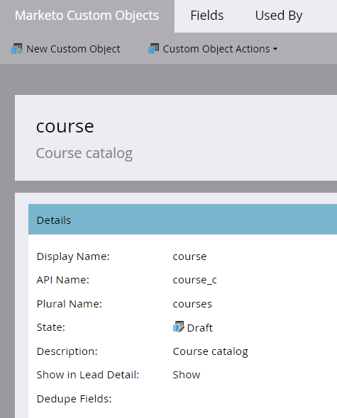
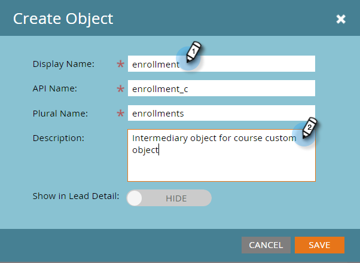
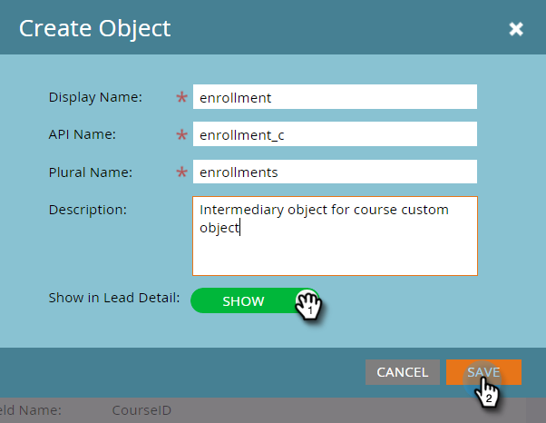

# Marketo カスタムオブジェクトの作成 {#create-marketo-custom-objects}

自社のビジネスに特有の指標をトラッキングするには、Marketo カスタムオブジェクトを使用します。 これには、自動車からコースまで、何でも利用できます。Marketoでモデル化してキャンペーンを実施したい場合は、何でも利用できます。

>[!NOTE]
>
>1 対多または多対多で動作するカスタムオブジェクトを設定できます。 最初のオブジェクトも同じ方法で作成しますが、オブジェクトへのフィールドの追加を開始する際の手順は異なります。 詳しくは、[Marketo カスタムオブジェクトについて](/help/marketo/product-docs/administration/marketo-custom-objects/understanding-marketo-custom-objects.md)を参照してください。

>[!NOTE]
>
>カスタムオブジェクトが承認されると、リンクまたは重複排除フィールドの作成、編集、削除はできなくなります。

## 1 対多構造のカスタムオブジェクトの作成 {#create-a-custom-object-for-a-one-to-many-structure}

この例では、1 対多の構造で使用する「自動車」カスタムオブジェクトを示します。 後で、多対多の構造で使用するコースカスタムオブジェクトと中間オブジェクトを作成します。

1. 「**[!UICONTROL 管理者]**」領域に移動します。

   

1. 「**[!UICONTROL Marketo カスタムオブジェクト]**」をクリックします。

   

1. 「**[!UICONTROL 新規カスタムオブジェクト]**」をクリックします。

   

   >[!NOTE]
   >
   >「[!UICONTROL Marketo カスタムオブジェクト]」タブには、右側にすべてのカスタムオブジェクトと、最新の更新時のレコード数とフィールド数を含む、承認済みオブジェクトの詳細が表示されます。

1. [!UICONTROL 表示名]を入力します。 「[!UICONTROL API 名]」と「[!UICONTROL 複数形の名前]」は自動的に入力されます。 [!UICONTROL 説明]を入力します（オプション）。

   

   >[!NOTE]
   >
   >これらのフィールドは作成時に編集できますが、保存した後は、[!UICONTROL 複数名] フィールドと&#x200B;**[!UICONTROL リード詳細を表示]** スライダーのみを編集できます。

1. データベースページにカスタムオブジェクトデータを表示する場合、「**[!UICONTROL リード詳細で表示]**」スライダーを引いて、「**[!UICONTROL 表示]**」を表示します。 「**[!UICONTROL 保存]**」をクリックします。

   

1. カスタムオブジェクト情報には、入力した内容が表示されます。 **[!UICONTROL ドラフト]**&#x200B;状態であることに注意してください。

   

   次の手順は、フィールドを追加して、[カスタムオブジェクトを作成](/help/marketo/product-docs/administration/marketo-custom-objects/add-marketo-custom-object-fields.md)します。

   >[!NOTE]
   >
   >Marketo カスタムオブジェクトの入力は、リストのインポート、または [API](https://experienceleague.adobe.com/ja/docs/marketo-developer/marketo/rest/rest-api) 経由でのみ可能です。

## 多対多構造のカスタムオブジェクトの作成 {#create-a-custom-object-for-a-many-to-many-structure}

この例では、コースのカスタムオブジェクトを示します。このオブジェクトを使用して、人物や企業とコースの間に多対多の関係を作成します。 完了したら、データベース内の人物や企業に接続するための仲介者オブジェクトを作成します。

>[!NOTE]
>
>多対多の関係の場合、カスタムオブジェクトにリンクを作成する必要はありません。 代わりに、中間オブジェクトに2つのリンクを追加します（以下を参照）。

1. 「**[!UICONTROL 管理者]**」領域に移動します。

   

1. 「**[!UICONTROL Marketo カスタムオブジェクト]**」をクリックします。

   

1. 「**[!UICONTROL 新規カスタムオブジェクト]**」をクリックします。

   

1. [!UICONTROL 表示名]を入力します。 「[!UICONTROL API 名]」と「[!UICONTROL 複数形の名前]」は自動的に入力されます。 [!UICONTROL 説明]を入力します（オプション）。

   

   >[!NOTE]
   >
   >これらのフィールドは作成時に編集できますが、保存した後は、[!UICONTROL 複数名] フィールドと&#x200B;**[!UICONTROL リード詳細を表示]** スライダーのみを編集できます。

1. データベースページにカスタムオブジェクトデータを表示する場合、「**[!UICONTROL リード詳細で表示]**」スライダーを引いて、「**[!UICONTROL 表示]**」を表示します。 「**[!UICONTROL 保存]**」をクリックします。

   

1. カスタムオブジェクト情報には、入力した内容が表示されます。 **[!UICONTROL ドラフト]**&#x200B;状態であることに注意してください。

   

   >[!NOTE]
   >
   >Marketo カスタムオブジェクトの入力は、リストのインポート、または [API](https://experienceleague.adobe.com/ja/docs/marketo-developer/marketo/rest/rest-api) 経由でのみ可能です。

次の手順では、仲介オブジェクトを作成します（以下を参照）。 その前に、リンクするフィールドを作成する必要があります。

## 中間オブジェクトの作成 {#create-an-intermediary-object}

カスタムオブジェクトを人物や会社に接続するには、中間オブジェクトを使用します。 この例では、コースカスタムオブジェクトのコースをデータベース内の人物または企業に接続するために使用します。

>[!NOTE]
>
>1対多のカスタムオブジェクト構造の中間オブジェクトを作成する必要はありません。

1. 「**[!UICONTROL 管理者]**」領域に移動します。

   

1. 「**[!UICONTROL Marketo カスタムオブジェクト]**」をクリックします。

   

1. 「**[!UICONTROL 新規カスタムオブジェクト]**」をクリックします。

   

1. [!UICONTROL 表示名]を入力します。 「[!UICONTROL API 名]」と「[!UICONTROL 複数形の名前]」は自動的に入力されます。 [!UICONTROL 説明]を入力します（オプション）。

   

   >[!NOTE]
   >
   >これらのフィールドは作成時に編集できますが、保存した後は、[!UICONTROL 複数名] フィールドと[!UICONTROL  リード詳細を表示] スライダーのみを編集できます。

1. データベースページにカスタムオブジェクトデータを表示する場合、「**[!UICONTROL リード詳細で表示]**」スライダーを引いて、「**[!UICONTROL 表示]**」を表示します。 「**[!UICONTROL 保存]**」をクリックします。

   

1. カスタムオブジェクト情報には、入力した内容が表示されます。 **[!UICONTROL ドラフト]**&#x200B;状態であることに注意してください。

   次の手順では、[ リンクフィールドを追加](/help/marketo/product-docs/administration/marketo-custom-objects/add-marketo-custom-object-link-fields.md)して、仲介オブジェクトを個人または会社とカスタムオブジェクトに接続します。

>[!MORELIKETHIS]
>
>* [Marketo カスタムオブジェクトフィールドの追加](/help/marketo/product-docs/administration/marketo-custom-objects/add-marketo-custom-object-fields.md)
>* [Marketo カスタムオブジェクトリンクフィールドの追加](/help/marketo/product-docs/administration/marketo-custom-objects/add-marketo-custom-object-link-fields.md)
>* [Marketo カスタムオブジェクトについて](/help/marketo/product-docs/administration/marketo-custom-objects/understanding-marketo-custom-objects.md)
