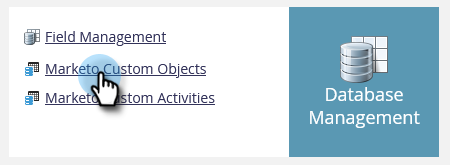

# カスタムオブジェクトメタデータのエクスポート {#custom-object-metadata-export}

当社の SOAP API または Munchkin API を使用している場合は、カスタムオブジェクトメタデータスキーマをエクスポートできます。手順は次のとおりです

1. My Marketo で、「**管理者**」をクリックします。

   

1. 「**Marketo カスタムオブジェクト**」をクリックします。

   

1. エクスポートする Marketo カスタムオブジェクトを選択します。

   

1. 「**カスタムオブジェクトのアクション**」ドロップダウンをクリックして「**オブジェクトをエクスポート**」を選択します。

   

>[!NOTE]
>
>エクスポートするには、カスタムオブジェクトのステートが承認済みである必要があります。

これで、3 つのタブをまたぐカスタムオブジェクトのスキーマを含むスプレッドシートが取得できました。

