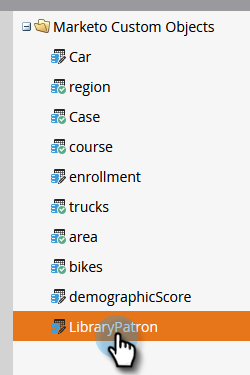

# カスタムオブジェクトメタデータのエクスポート {#custom-object-metadata-export}

SOAP APIまたは[!DNL Munchkin] APIを使用している場合は、カスタムオブジェクトメタデータスキーマを書き出すことができます。 次の手順に従います。

>[!AVAILABILITY]
>
>すべての Marketo Engage ユーザがこの機能を購入しているわけではありません。 詳しくは、アドビのアカウントチーム（担当のアカウントマネージャー）にお問い合わせください。

1. 「**[!UICONTROL 管理者]**」領域に移動します。

   

1. 「**[!UICONTROL Marketo カスタムオブジェクト]**」をクリックします。

   

1. エクスポートする Marketo カスタムオブジェクトを選択します。

   

1. 「**[!UICONTROL カスタムオブジェクトのアクション]**」ドロップダウンをクリックして「**[!UICONTROL オブジェクトをエクスポート]**」を選択します。

   

>[!NOTE]
>
>エクスポートするには、カスタムオブジェクトのステートが承認済みである必要があります。

これで、3つのタブにまたがるカスタムオブジェクトのスキーマを含むスプレッドシートができました。

