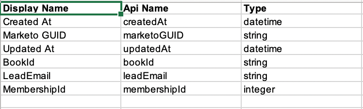

# カスタムオブジェクトメタデータの書き出し{#custom-object-metadata-export}

SOAP APIまたはMunchkin APIを使用している場合は、カスタムオブジェクトメタデータスキーマを書き出すことができます。 手に入れる方法は次の通りです。

1. マイMarketoで、**管理者**&#x200B;をクリックします。

   

1. 「**Marketoカスタムオブジェクト**」をクリックします。

   

1. 書き出すMarketoカスタムオブジェクトを選択します。

   

1. 「**カスタムオブジェクトアクション**」ドロップダウンをクリックし、「**オブジェクトを書き出し**」を選択します。

   

>[!NOTE]
>
>エクスポートするには、カスタムオブジェクトが「承認済み」状態になっている必要があります。

これで、3つのタブにわたるカスタムオブジェクトのスキーマを持つスプレッドシートが作成されました。

