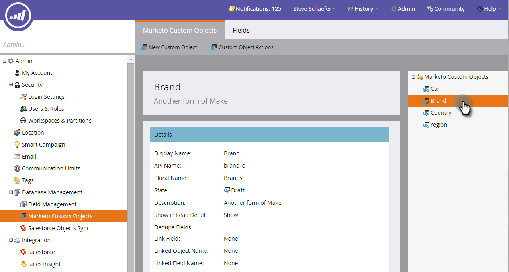

# マーケティング対象カスタムオブジェクトの編集と削除{#edit-and-delete-a-marketo-custom-object}

>[!NOTE]
>
>カスタムオブジェクトが承認された後は、リンクまたは重複除外フィールドの作成、編集、削除はできません。

## カスタムオブジェクトの編集{#edit-a-custom-object}

カスタムオブジェクトを編集または削除するには、カスタムオブジェクトアクションメニューを使用します。

1. 「**管理者**」をクリックし、「**データベース管理**」で「**マーケティング先カスタムオブジェクト**」を選択します。

   

1. 右側で編集するカスタムオブジェクトを選択します。

   

1. 「**カスタムオブジェクトアクション**」タブをクリックし、「**オブジェクトを編集**」をクリックします。

   

   >[!NOTE]
   >
   >「オブジェクトを編集」には、編集できないAPI名を除き、「オブジェクトを作成」と同じフィールドが表示されます。

1. 変更を加えます。 スライダを上にドラッグして、リードの詳細ページにオブジェクトを表示します。 「**保存**」をクリックします。

   

1. [編集したオブジェクト](/help/marketo/product-docs/administration/marketo-custom-objects/approve-a-custom-object.md)を必ず承認してください。

## カスタムオブジェクトの削除{#delete-a-custom-object}

カスタムオブジェクトは簡単に削除できますが、注意が必要です。 カスタムオブジェクトは、他のオブジェクトやスマートリストに接続できます。 そのため、「**削除**」をクリックする前に、Marketorは警告を表示します。

>[!CAUTION]
>
>カスタムオブジェクトを削除した後は、カスタムオブジェクトを復元することはできません。

1. 「**管理者**」をクリックし、「**データベース管理**」で「**マーケティング先カスタムオブジェクト**」を選択します。

   

1. 削除するオブジェクトを選択します。

   

1. 「**カスタムオブジェクトアクション**」をクリックし、「**オブジェクトを削除**」を選択します。

   

   >[!TIP]
   >
   >また、オブジェクトを右クリックし、「**オブジェクトを削除**」を選択することもできます。

1. カスタムオブジェクトがドラフト形式で、まだ承認されていない場合は、この警告が表示されます。 確認したら、「**削除**」をクリックします。

   

1. カスタムオブジェクトが既に承認されている場合は、削除するとリスクが高くなります。 この警告を受け取ります 「**I understand**」と入力し、「**元に戻せません**」チェックボックスをオンにして、「**削除**」をクリックします。

   

   >[!NOTE]
   >
   >カスタムオブジェクトが中間オブジェクトにリンクされている場合は、まず中間オブジェクトを削除する必要があります。

>[!MORELIKETHIS]
>
>[カスタムオブジェクトの承認](/help/marketo/product-docs/administration/marketo-custom-objects/approve-a-custom-object.md)
