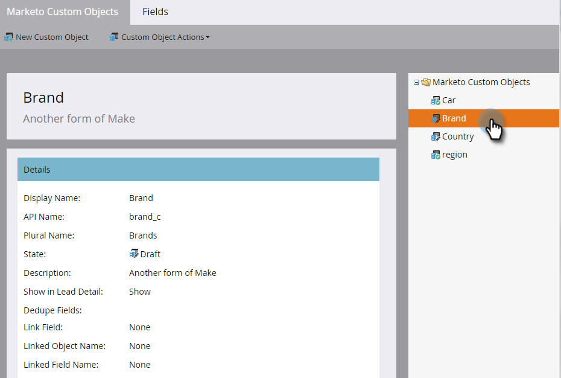

# Marketo カスタムオブジェクトの編集と削除 {#edit-and-delete-a-marketo-custom-object}

>[!NOTE]
>
>カスタムオブジェクトが承認されると、リンクまたは重複排除フィールドの作成、編集、削除はできなくなります。

## カスタムオブジェクトの編集 {#edit-a-custom-object}

カスタムオブジェクトを編集または削除するには、カスタムオブジェクトアクションメニューを使用します。

1. 「**[!UICONTROL 管理者]**」領域に移動します。

   

1. 「**[!UICONTROL Marketo カスタムオブジェクト]**」をクリックします。

   

1. 右側で編集するカスタムオブジェクトを選択します。

   

1. 「**[!UICONTROL カスタムオブジェクトアクション]**」タブをクリックし、「**[!UICONTROL オブジェクトを編集]**」をクリックします。

   

1. 必要な変更を加えます。 リード詳細ページにオブジェクトを表示する場合は、スライダーをドラッグします。 「**[!UICONTROL 保存]**」をクリックします。

   

1. [編集したオブジェクト ](/help/marketo/product-docs/administration/marketo-custom-objects/approve-a-custom-object.md)を承認します。

## カスタムオブジェクトの削除 {#delete-a-custom-object}

カスタムオブジェクトの削除には注意が必要です。 カスタムオブジェクトは、他のオブジェクトやスマートリストに接続できます。 **[!UICONTROL 削除]**&#x200B;をクリックする前に、Marketoから警告が表示されます。

>[!CAUTION]
>
>カスタムオブジェクトを削除した後は、そのオブジェクトは復元できません。

1. 「**[!UICONTROL 管理者]**」領域に移動します。

   

1. 「**[!UICONTROL Marketo カスタムオブジェクト]**」をクリックします。

   

1. 削除するオブジェクトを選択します。

   

1. 「**[!UICONTROL カスタムオブジェクトのアクション]**」をクリックし、「**[!UICONTROL オブジェクトを削除]**」を選択します。

   

   >[!TIP]
   >
   >オブジェクトを右クリックし、「**[!UICONTROL オブジェクトを削除]**」を選択することもできます。

1. カスタムオブジェクトがまだ承認されていないドラフトフォームの場合は、この警告が表示されます。 確信がある場合は、**[!UICONTROL 削除]**&#x200B;をクリックしてください。

   

1. カスタムオブジェクトが既に承認されている場合、削除するとリスクが高くなります。 したがって、この厳格な警告が表示されます。 「**[!UICONTROL I understand]**」と入力し、「**[!UICONTROL 取り消しできません]**」チェックボックスをオンにして、「**[!UICONTROL 削除]**」をクリックします。

   

   >[!NOTE]
   >
   >カスタムオブジェクトが中間オブジェクトにリンクされている場合は、最初に中間オブジェクトを削除する必要があります。

>[!MORELIKETHIS]
>
>[カスタムオブジェクトの承認](/help/marketo/product-docs/administration/marketo-custom-objects/approve-a-custom-object.md)
