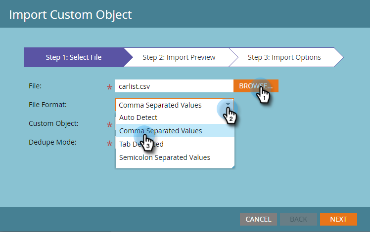
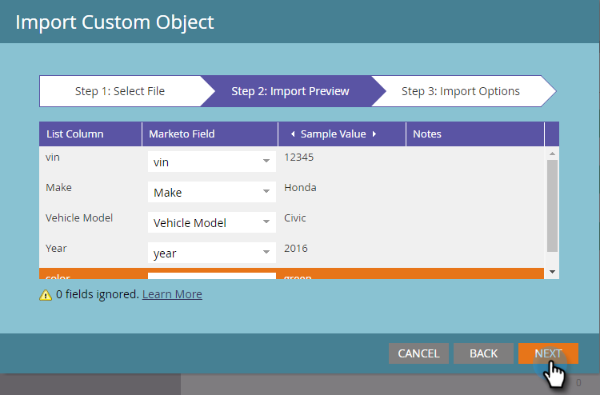

# カスタムオブジェクトデータのインポート {#import-custom-object-data}

カスタムオブジェクトデータをデータベースに簡単にインポートすることができます。会社でカスタムオブジェクトを使用する場合、詳しくは、[会社でカスタムオブジェクトを使用する](/help/marketo/product-docs/administration/marketo-custom-objects/understanding-marketo-custom-objects.md#using-custom-objects-with-companies)を参照してください。

1. My Marketo で、「**データベース**」に移動します。

   

1. 「**新規**」をクリックし、「**カスタムオブジェクトデータをインポート**」を選択します。

   

1. 「**参照**」をクリックして、データファイルを探します。ファイル形式（この例では「コンマ区切り値」）を選択します。

   

1. カスタムオブジェクトを選択します。

   

1. ドロップダウンから「重複排除モード」を選択します。「**次へ**」をクリックします。

   

   >[!NOTE]
   >
   >カスタムオブジェクトレコードを作成または更新する際に、重複排除フィールドを一意の識別子として使用します。この例では、「**car**」カスタムオブジェクトの重複排除フィールドとして「vin」（車両の ID 番号）を使用します。カスタムオブジェクトのレコードを更新するだけの場合は、重複排除モードとして「Marketo Guid」を選択できます。

1. ドロップダウンで選択して、各列を Marketo のフィールドにマップします。

   

   >[!NOTE]
   >
   >ファイル内の値が、照合先のフィールドのタイプ（テキスト、整数など）と一致することを確認してください。一致しない場合、ファイルは拒否されます。

1. 「**次へ**」をクリックします。

   

1. 「**インポート**」をクリックします。

   

   >[!NOTE]
   >
   >カスタムオブジェクトのサイズの上限は 100 MB です。

   >[!TIP]
   >
   >「**アラートの送信先**」にメールアドレスを入力すると、インポートの完了時にメールが届きます。

1. 画面の右上隅に、インポート実行中には通知が表示され、完了すると最終結果が表示されます。

   

   これで完了です。

>[!MORELIKETHIS]
>
>[Marketo カスタムオブジェクトについて](/help/marketo/product-docs/administration/marketo-custom-objects/understanding-marketo-custom-objects.md)
