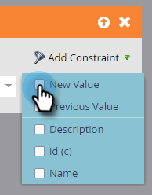

# カスタムオブジェクトの変更のトリガー {#trigger-off-custom-object-changes}

>[!NOTE]
>
>この機能は以下の場合にのみ使用できます。
>
>* Marketo カスタムオブジェクトでのみ使用し、ネイティブの [!DNL Salesforce] または [!DNL Microsoft Dynamics] 統合を通じて同期されたカスタムオブジェクトでは使用しません。
>
>* フィルターとしてではなくトリガーとして使用
>
>カスタムオブジェクト変更トリガーを有効にするには、[Marketo サポート &#x200B;](https://nation.marketo.com/t5/Support/ct-p/Support)にお問い合わせください。

スマートキャンペーンのスマートリストでは、カスタムオブジェクトが個人または会社に追加されたときのフローアクションをトリガーできます。 また、カスタムオブジェクトの&#x200B;_変更_&#x200B;をトリガーとして使用するスマートリストを作成することもできます。 例えば、コース名が更新されたときにメールを送信する場合に使用します。

>[!NOTE]
>
>カスタムオブジェクトレコードが変更されても、アクティビティログエントリは作成されません。

1. Marketo Engage で、**[!UICONTROL マーケティングアクティビティ]**&#x200B;に移動します。

   

1. 既存のスマートキャンペーンを作成するか開いて、「スマートリスト」を選択します。

   

1. 必要なトリガーを検索し、キャンバスにドラッグします。

   

1. [!UICONTROL トリガー属性]を選択します。

   

1. オプションで、制約を設定します。

   

1. 変更は自動的に保存されます。

   

   >[!NOTE]
   >
   >* [スマートリストの作成](/help/marketo/product-docs/core-marketo-concepts/smart-lists-and-static-lists/creating-a-smart-list/create-a-smart-list.md)
   >* [Marketo カスタムオブジェクトについて](/help/marketo/product-docs/administration/marketo-custom-objects/understanding-marketo-custom-objects.md)
