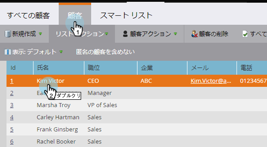

# Marketo カスタムオブジェクトについて {#understanding-marketo-custom-objects}

自社のビジネスに固有の指標をトラックするには、カスタムオブジェクトを使用します。

>[!AVAILABILITY]
>
>すべてのお客様がこの機能を購入しているわけではありません。詳細は、セールス担当者にお問い合わせください。

スマートキャンペーンでは、フィルターおよびトリガーとしてカスタムオブジェクトを使用します。例：

* **フィルター**：特定の自動車ブランドのオーナーにのみメールを送信する
* **トリガー**：カスタムオブジェクトが人または会社に追加されたときにメールを送信する

カスタムオブジェクトは、1 対多または多対多の関係で設定できます。例：

* **1 対多**：1 人の人が複数の自動車を所有している
* **多対多**：複数の学生がコースカタログの複数のコースに登録する

1 対多の構造では、1 つのリンクフィールドを使用してカスタムオブジェクトを人または会社に結び付けます。

多対多のカスタムオブジェクトは、2 つのリンクフィールドと、中間オブジェクトの一部を使用します。一方のリンクフィールドは人または会社に結び付けられ、もう一方はカスタムオブジェクト、例えばコースカタログに結び付けられます。この中間オブジェクトに、さらに他のカスタムフィールド（例えばコースの等級、出席日など）を含め、関係の性質を詳細に定義することができます。

>[!TIP]
>
>データサンプルをテストして検証するには、ユーザーインターフェイスでカンマ区切りの値リスト（CSV）を使用してカスタムオブジェクトをインポートし、API を利用してそのファイルをすべてアップロードします。

>[!CAUTION]
>
>カスタムオブジェクトは復元できないので、削除する前に、本当に不要かどうか確かめてください。

## Marketo カスタムオブジェクトへのアクセス {#accessing-marketo-custom-objects}

1. Marketo カスタムオブジェクトを作成または編集するには、「**管理**」、「**Marketo カスタムオブジェクト**」リンクの順にクリックします。

   

1. 「Marketo カスタムオブジェクト」で、右側にカスタムオブジェクトがすべてリストされますが、表示されるのはメイングリッドに公開されたオブジェクトだけです。

   

1. グリッドには、オブジェクト名、レコード数、フィールド数、最新の更新日時が表示されます。

   >[!TIP]
   >
   >各フィールドは自動的に更新されますが、「レコード」列のアイコンをクリックすれば更新できます。

1. 右のオブジェクト名をクリックすると、詳細ページが開きます。

   

## 人に関連付けられたカスタムオブジェクトの表示 {#view-custom-objects-associated-to-a-person}

カスタムオブジェクト構造を作成しておくと、特定のカスタムオブジェクトデータをアップロードするときに、カスタムオブジェクトがデータベースの人に自動的に関連付けられます。このとき利用されるのは、カスタムオブジェクトのリンクフィールドです。情報は、リード詳細ページの「カスタムオブジェクト」タブで確認できます。

1. **データベース**&#x200B;に移動します。

   

1. データベースを開き、「**リード**」タブをクリックします。カスタムオブジェクトに関連付ける人のレコードをダブルクリックします。

   

1. リード詳細ページで「**カスタムオブジェクト**」タブをクリックし、ドロップダウンからオブジェクトを選択します。

   

1. これで、その人に関連付けられたタイプのカスタムオブジェクトのすべてがリスト表示されます。

   

## 企業へのカスタムオブジェクトの使用 {#using-custom-objects-with-companies}

企業にリンクされたカスタムオブジェクトは、CRM から企業を同期する場合、または API を利用して明示的に企業を作成する場合に最もうまく機能します。企業 ID をリンクフィールドとして使用することをお勧めします。

Marketo に複数の人が設定されていて、それが CRM のリードレコード、または Marketo のみのレコードである場合、企業にリンクされているカスタムオブジェクトは、複数の個別のリードレコードには関連付けられません。複数の人がいる 1 つの企業がサポートされるのは、企業が CRM から同期されるか、API を使用して明示的に企業を作成する場合だけだからです。

カスタムオブジェクトは、1 つのリードレコードにしか直接リンクできません。つまり、カスタムオブジェクトのタイプが企業フィールドによってリンクされているときには、CRM で連絡先のコンバージョンを使用して、個人のレコードを企業に関連付ける必要があるということです。あるいは、Marketo の REST API で企業を管理している場合には、externalCompanyId フィールドを使用して関連付ける必要があります。個人レコードが明示的に企業レコードにリンクされていない場合は、たとえ企業フィールドの値が複数の人によって共有されていても、企業を使用してリンクされているカスタムオブジェクトが 1 つのリードレコードにリンクされることはまれです。

詳細については、[カスタムオブジェクトデータのインポート](/help/marketo/product-docs/administration/marketo-custom-objects/import-custom-object-data.md)を参照してください。

>[!MORELIKETHIS]
>
>* [Marketo カスタムオブジェクトの作成](/help/marketo/product-docs/administration/marketo-custom-objects/create-marketo-custom-objects.md)
>* [カスタムオブジェクトの承認](/help/marketo/product-docs/administration/marketo-custom-objects/approve-a-custom-object.md)
>* [Marketo カスタムオブジェクトの編集と削除](/help/marketo/product-docs/administration/marketo-custom-objects/edit-and-delete-a-marketo-custom-object.md)
>* [Marketo カスタムオブジェクトフィールドの追加](/help/marketo/product-docs/administration/marketo-custom-objects/add-marketo-custom-object-fields.md)
>* [Marketo カスタムオブジェクトフィールドの編集と削除](/help/marketo/product-docs/administration/marketo-custom-objects/edit-and-delete-marketo-custom-object-fields.md)
>* [カスタムオブジェクトデータのインポート](/help/marketo/product-docs/administration/marketo-custom-objects/import-custom-object-data.md)

