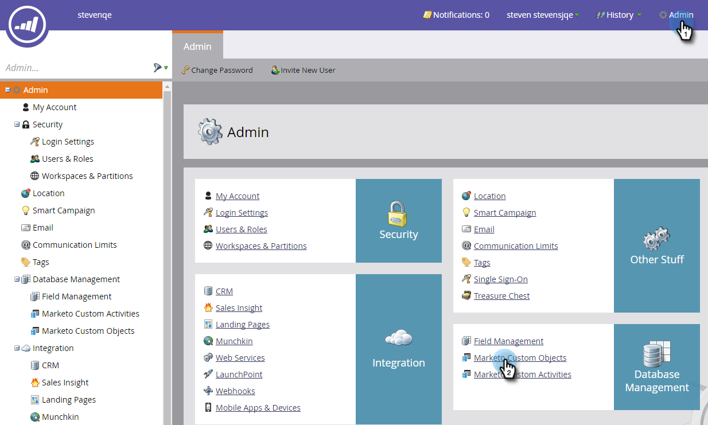
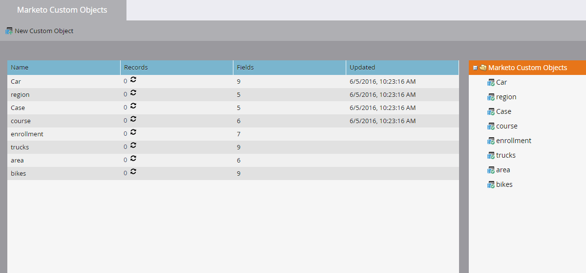
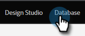
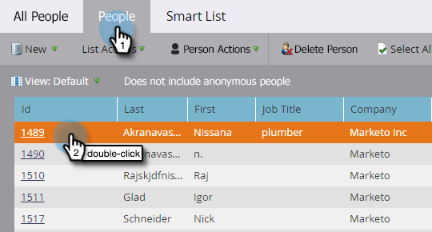
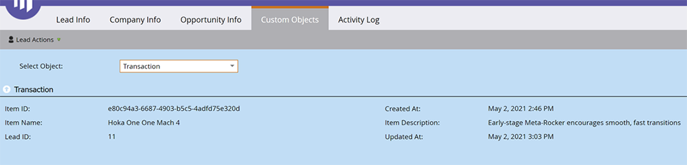
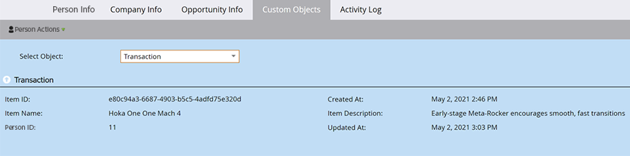

# Marketo カスタムオブジェクトについて {#understanding-marketo-custom-objects}

自社のビジネスに特有の指標をトラッキングするには、カスタムオブジェクトを使用します。

>[!AVAILABILITY]
>
>すべての Marketo Engage ユーザがこの機能を購入しているわけではありません。 詳しくは、アドビのアカウントチーム（担当のアカウントマネージャー）にお問い合わせください。

スマートキャンペーンでは、フィルターおよびトリガーとしてカスタムオブジェクトを使用します。 例：

* **フィルター**：特定の自動車ブランドのオーナーにのみメールを送信する
* **トリガー**：カスタムオブジェクトが人または会社に追加されたときにメールを送信する

カスタムオブジェクトは、1 対多または多対多の関係で設定できます。 例：

* **1 対多**：1 人の人が複数の自動車を所有している
* **多対多**：複数の学生がコースカタログの複数のコースに登録する

1 対多の構造では、1 つのリンクフィールドを使用してカスタムオブジェクトを人または会社に結び付けます。

多対多のカスタムオブジェクトは、2 つのリンクフィールドと、中間オブジェクトの一部を使用します。 一方のリンクフィールドは人または会社に結び付けられ、もう一方はカスタムオブジェクト、例えばコースカタログに結び付けられます。 この中間オブジェクトに、さらに他のカスタムフィールド（例えばコースの等級、出席日など）を含め、関係の性質を詳細に定義することができます。

>[!TIP]
>
>データサンプルをテストして検証するには、ユーザーインターフェイスでカンマ区切りの値リスト（CSV）を使用してカスタムオブジェクトをインポートし、 API を利用してそのファイルをすべてアップロードします。

>[!CAUTION]
>
>カスタムオブジェクトは復元できないので、削除する前に不要になっていることを確認してください。

## Marketo カスタムオブジェクトへのアクセス {#accessing-marketo-custom-objects}

1. 「**[!UICONTROL 管理者]**」領域に移動します。

   

1. 「**[!UICONTROL Marketo カスタムオブジェクト]**」をクリックします。

   

1. 「Marketo カスタムオブジェクト」で、右側にカスタムオブジェクトがすべてリストされますが、表示されるのはメイングリッドに公開されたオブジェクトだけです。

   

   >[!NOTE]
   >
   >グリッドには、オブジェクト名、レコード数、フィールド数、最新の更新日時が表示されます。

   >[!TIP]
   >
   >各フィールドは自動的に更新されますが、「レコード」列のアイコンをクリックすれば表示を更新できます。

1. 右のオブジェクト名をクリックすると、詳細ページが開きます。

   

## 人物に関連付けられたカスタムオブジェクトの表示 {#view-custom-objects-associated-to-a-person}

カスタムオブジェクト構造を作成した後、特定のカスタムオブジェクトデータをアップロードすると、カスタムオブジェクトのリンクフィールドを使用して、カスタムオブジェクトがデータベース内のユーザーに自動的に関連付けられます。 情報は、人物詳細ページの「[!UICONTROL カスタムオブジェクト]」タブで確認できます。

1. **[!UICONTROL データベース]**&#x200B;に移動します。

   

1. データベースを開き、「**[!UICONTROL 人物]**」タブをクリックします。 カスタムオブジェクトに関連付ける人物のレコードをダブルクリックします。

   

1. リード詳細ページで「**[!UICONTROL カスタムオブジェクト]**」タブをクリックし、 ドロップダウンからオブジェクトを選択します。

   

1. これで、その人物に関連付けられたタイプのカスタムオブジェクトのすべてがリスト表示されます。

   

   >[!NOTE]
   >
   >人物レコードでは、「カスタムオブジェクト」タブに最大 100 件のレコードを ID の降順に並べ替えて表示できます。

## 企業へのカスタムオブジェクトの使用 {#using-custom-objects-with-companies}

会社にリンクされたカスタムオブジェクトは、CRMから会社を同期する場合や、APIを使用して会社を明示的に作成する場合に最も効果的です。 Marketoでは、リンク フィールドとして会社IDを使用することもできます。

MarketoにCRMまたはMarketo専用レコードのレコードを持つ複数のユーザーがいる場合、会社にリンクされたカスタムオブジェクトは、複数の個人レコードに関連付けられません。 複数の人物がいる 1 つの企業がサポートされるのは、企業が CRM から同期されるか、API を使用して明示的に企業を作成する場合だけだからです。

カスタムオブジェクトは、1 つのレコードにしか直接リンクできません。 つまり、カスタムオブジェクトのタイプが企業フィールドによってリンクされているときには、CRM で連絡先のコンバージョンを使用して、人物レコードを企業に関連付ける必要があるということです。あるいは、Marketo の REST API で企業を管理している場合には、externalCompanyId フィールドを使用して関連付ける必要があります。 会社レコードに明示的にリンクされていない個人レコードの場合、会社を使用してリンクされたカスタムオブジェクトは、会社フィールドの値が多くの人で共有されている場合でも、1つのレコードにランダムにリンクされます。

詳しくは、[カスタムオブジェクトデータのインポート](/help/marketo/product-docs/administration/marketo-custom-objects/import-custom-object-data.md)を参照してください。

>[!MORELIKETHIS]
>
>* [Marketo カスタムオブジェクトの作成](/help/marketo/product-docs/administration/marketo-custom-objects/create-marketo-custom-objects.md)
>* [カスタムオブジェクトの承認](/help/marketo/product-docs/administration/marketo-custom-objects/approve-a-custom-object.md)
>* [Marketo カスタムオブジェクトの編集と削除](/help/marketo/product-docs/administration/marketo-custom-objects/edit-and-delete-a-marketo-custom-object.md)
>* [Marketo カスタムオブジェクトフィールドの追加](/help/marketo/product-docs/administration/marketo-custom-objects/add-marketo-custom-object-fields.md)
>* [Marketo カスタムオブジェクトフィールドの編集と削除](/help/marketo/product-docs/administration/marketo-custom-objects/edit-and-delete-marketo-custom-object-fields.md)
>* [カスタムオブジェクトデータのインポート](/help/marketo/product-docs/administration/marketo-custom-objects/import-custom-object-data.md)
