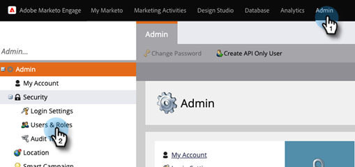
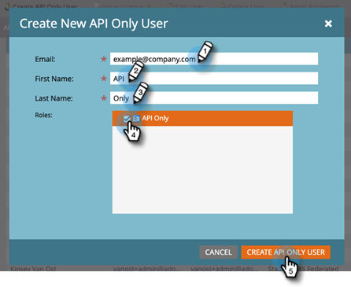

# API 専用ユーザを追加し、Adobe IMSが有効な購読 {#add-api-only-user-for-adobe-ims-enabled-subscriptions}

Marketo Engageマーケティングユーザーと管理者はAdobe Admin Consoleで管理しますが、Marketo EngageAPI のみのユーザーはMarketo Engageで作成および管理する必要があります。

以下の手順では、API のみのユーザーを追加する方法をMarketo Engageします。 その前に、 [API 専用の役割を確立](/help/marketo/product-docs/administration/users-and-roles/create-an-api-only-user-role.md).

1. Marketoで、 **管理者** を選択し、 **ユーザーとロール**.

   

1. クリック **API 専用ユーザーを作成**.

   

1. API 専用ユーザーの「電子メール」、「名」および「姓」を入力します。  ユーザーに割り当てる API のみの役割を選択します。 クリック **API 専用ユーザーを作成** 完了したら、

   

>[!NOTE]
>
>アクションが正常に完了すると、「 API のみのユーザーを作成」モーダルが閉じ、ユーザーリストが更新され、新しいユーザーが表示されます。
