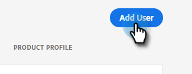

# ユーザーの追加または削除 {#add-or-remove-a-user}

## ユーザーの追加 {#add-a-user}

1. にログインします。 [Adobe Admin Console](https://adminconsole.adobe.com/).

   

1. クリック **Marketo Engage**.

   

1. 目的の購読を選択します（複数ある場合）。

   

1. 「**ユーザー**」タブをクリックします。

   

1. 次をクリック： **ユーザーを追加** 」ボタンをクリックします。

   

1. 追加するユーザーの名前、ユーザーグループ、または電子メールアドレスを入力します。 姓と名はオプションです。

   

1. 次をクリック： **+** アイコンをクリックし、目的の製品プロファイルを選択します。

   

1. 「**保存**」をクリックします。

   

その後、Marketoにログインするための電子メールがユーザーに送信されます。

>[!NOTE]
>
>Adobe Admin Consoleを使用してMarketo Engageに追加されたユーザーには、購読のデフォルトワークスペース内で「標準ユーザー」の役割が付与されます。 ワークスペース内でのユーザーの役割を調整する必要がある場合は、Marketo Engageで行います。 [ここで説明するように](/help/marketo/product-docs/administration/users-and-roles/managing-user-roles-and-permissions.md).

## ユーザーの削除 {#remove-a-user}

1. にログインします。 [Adobe Admin Console](https://adminconsole.adobe.com/).

   

1. クリック **Marketo Engage**.

   

1. 目的の購読を選択します（複数ある場合）。

   

1. 「**ユーザー**」タブをクリックします。

   

1. 削除するユーザーを選択し、 **削除** 」ボタンをクリックします。

   

1. クリック **ユーザーを削除** をクリックして確定します。

   

その後、ユーザーに、製品管理者が製品にアクセスできなくなったことを知らせる電子メールが送信されます。Marketo Engage

>[!MORELIKETHIS]
>
>* [Adobe Admin Console Users](https://helpx.adobe.com/enterprise/using/users.html)
>* [ユーザーを個別に管理](https://helpx.adobe.com/enterprise/using/manage-users-individually.html)

