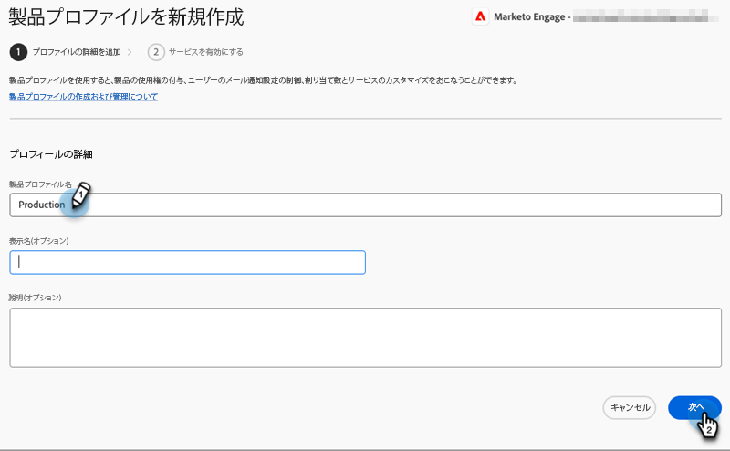

# 管理設定 {#admin-setup}

Adobe組織にMarketoシステム管理者として追加されたら、初期設定を完了するためにいくつかの手順を実行する必要があります。

## システム管理の設定 {#system-admin-setup}

1. Adobe組織が確立されると、指定されたシステム管理者にお知らせメールが届きます。 この電子メールで、「**使ってみる**」をクリックします。

   

1. 以前にAdobe IDを使用してアプリにアクセスしたことがある場合は、Adobe Admin Consoleに直接移動します。 そうでない場合は、[Adobe ID](https://helpx.adobe.com/manage-account/using/create-update-adobe-id.html)を設定します。

   

## 製品プロファイルの作成 {#create-a-product-profile}

システム管理者がAdmin Consoleにアクセスしたら、次に製品プロファイルを作成します。

1. 「製品とサービス」で、「**Marketo Engage**」をクリックします。

   

1. 目的の購読を選択します。 1つしかない場合は、次の手順に進みます。

   

   >[!NOTE]
   >
   >購読が複数ある場合は、各購読に対して次の手順を実行する必要があります。

1. 「**新しいプロファイル**」ボタンをクリックします。

   

1. 製品プロファイルに名前を付け（表示名と説明はオプション）、「**保存**」をクリックします。

   

>[!NOTE]
>
>複数の製品プロファイルを設定する場合、追加先のプロファイルに関係なく、ユーザーはMarketoに同じアクセス権を持ちます。

## 製品管理者の設定 {#product-admin-setup}

1. システム管理者から招待を受けると、「ようこそ」の電子メールが届きます。 この電子メールで、「**使ってみる**」をクリックします。

   

1. 以前にAdobe IDを使用してアプリにアクセスしたことがある場合は、Adobe Admin Consoleに直接移動します。 そうでない場合は、[Adobe ID](https://helpx.adobe.com/manage-account/using/create-update-adobe-id.html)を設定します。

   

単純だ！ 製品管理者は主にユーザーの追加を担当します。 [その方法については、こちらを参照してください](/help/marketo/product-docs/administration/marketo-with-adobe-identity/add-or-remove-a-user.md#add-a-user)。

>[!MORELIKETHIS]
>
>[製品管理者の追加または削除](/help/marketo/product-docs/administration/marketo-with-adobe-identity/add-or-remove-a-product-admin.md)
