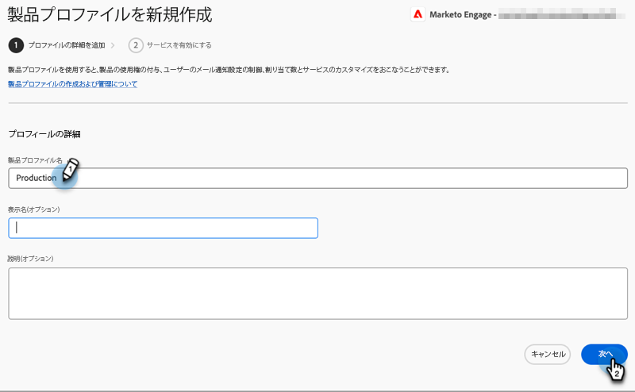

# 管理者設定 {#admin-setup}

Adobe組織でAdobe システム管理者としてMarketo Engageに追加された後、初期設定を完了するために必要な手順がいくつかあります。

## 初期設定 {#initial-setup}

1. （新しい組織または既存の組織で）Marketo Engageの指定システム管理者として追加された後、ウェルカムメールが届きます。 そのメールで、「**[!UICONTROL 開始する]**」をクリックします。

   

1. 以前にAdobe IDでアプリケーションにアクセスしたことがある場合は、Adobe Admin Consoleに直接アクセスできます。 そうでない場合、[Adobe ID を設定](https://helpx.adobe.com/jp/manage-account/using/create-update-adobe-id.html){target="_blank"}します。

   

## 製品プロファイルの作成 {#create-a-product-profile}

システム管理者がAdmin Consoleにアクセスしたら、次は製品プロファイルを作成します。 これは、ユーザーと管理者がMarketo Engageにアクセスする方法です。

1. **[!UICONTROL 概要]**&#x200B;ページの「**[!UICONTROL 製品とサービス]**」で、「**Marketo Engage**」をクリックします。

   

1. 目的のサブスクリプションを選択します。 1 つのみの場合は、次の手順に進みます。

   

   >[!NOTE]
   >
   >サブスクリプションが複数ある場合は、それぞれの手順に従う必要があります。

1. 「**[!UICONTROL 新規プロファイル]**」ボタンをクリックします。

   

1. 製品プロファイルに名前を付け（表示名と説明はオプションです）、「**[!UICONTROL 次へ]**」をクリックします。

   

1. サービスを選択する必要はありません。 「**[!UICONTROL 保存]**」をクリックします。

>[!NOTE]
>
>複数の製品プロファイルを設定すると、どのプロファイルに追加されているかに関係なく、ユーザーはMarketoに同じアクセス権を持ちます。

>[!MORELIKETHIS]
>
>[製品管理者の追加または削除](/help/marketo/product-docs/administration/users-and-roles/add-or-remove-a-product-admin.md){target="_blank"}
