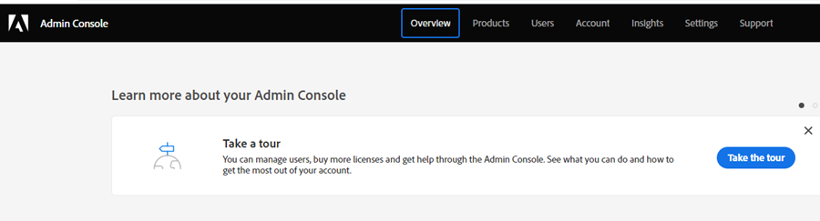

# 製品管理者の設定 {#product-admin-setup}

1. システム管理者から招待された後、ようこそメールが届きます。 そのメールで、「**[!UICONTROL 開始する]**」をクリックします。

   

1. 以前にAdobe IDでアプリケーションにアクセスしたことがある場合は、Adobe Admin Consoleに直接アクセスできます。 そうでない場合、[Adobe ID を設定](https://helpx.adobe.com/jp/manage-account/using/create-update-adobe-id.html){target="_blank"}します。

   

製品管理者は、主にユーザーの追加を担当します。 [その方法については、こちらをご覧ください](/help/marketo/product-docs/administration/users-and-roles/add-or-remove-a-user.md#add-a-user){target="_blank"}。
