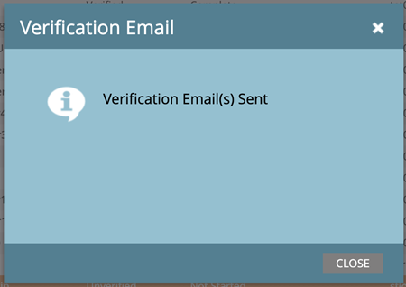
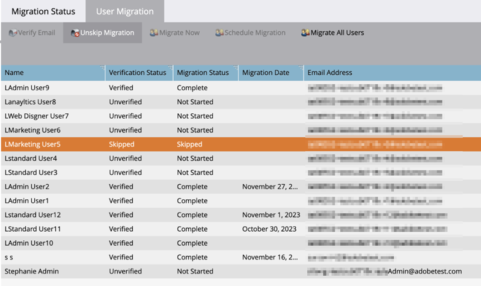

# AdobeID への移行 {#migrating-to-adobe-identity}

Adobeがサブスクリプションのユーザー移行をスケジュールする際、Marketo Engage製品管理者は移行コンソールにアクセスできます。このコンソールは、「統合」の下にある管理領域のナビゲーションメニューにあります。

## 移行前 {#pre-migration}

移行を開始する前に、管理者は、移行コンソールの移行前画面に移動して、購読のユーザー移行開始日を変更できます。 日付を変更するには、管理者が **編集** 」ボタンをクリックします。

管理者は、8 ～ 30 日後の日付を選択できます。 日付を選択した場合、管理者は **保存** 変更を加える

>[!NOTE]
>
>8 日前または 30 日以上の日付をリクエストする場合、または移行前コンソールのロック後に日付を調整する必要がある場合は、に電子メールを送信してください。 `marketocares@marketo.com`.

## AdobeID への移行 {#migrations-to-adobe-identity}

米国タイムゾーンを持つすべてのMarketoサブスクリプションは、ユーザー移行開始日の午前 0 時（太平洋標準時）から移行されます。 その他すべてのサブスクリプションのユーザー移行は、サブスクリプションの指定されたタイムゾーンの午前 0 時に開始されます。 サブスクリプションのユーザー移行が開始されると、Marketoの管理者領域ではユーザー管理ができなくなり、Adobe Admin Consoleでのみおこなわれます。 役割の管理は、Marketoの管理領域の「ユーザーと役割」タブおよびローカル（API のみ）のユーザー管理に残ります。

Adobeは、検証済みの E メールが最初に届いているすべてのMarketo管理者を自動的に移行します。 Marketo管理者がAdobeID に移行されると、Marketo購読のAdobe管理者として購読のAdobe Admin Consoleに追加され、Marketoアプリケーション内で製品管理者の役割（以前の役割と共に）が割り当てられ、Adobe IDに購読の資格が付与されます。 管理者には 2 通の電子メールが届きます。 1 つはAdobe製品管理者として割り当てられていることを示すもので、もう 1 つはAdobe IDがMarketo製品に対する権利を持っていることを示すものです。

**Marketo製品管理者の電子メール**

**Marketo Entitlement Email**

**Marketoサブスクリプションのユーザー数が 75 人未満で、MarketoやAdobe組織で SSO を使用していない場合。**&#x200B;の場合、Adobeは残りのユーザーを自動的に移行します。 このワークフローは、最高レベルの自動化を実現することを目的としており、移行を実行するためにアクションは必要ありません。 移行が完了すると、Marketo Migration Console がMarketo Admin ナビゲーション領域に表示されなくなり、すべてのユーザーがAdobe IDを使用してMarketoにアクセスするようになります。

**Marketoサブスクリプションに 75 人以上のユーザーがいる場合、またはMarketoやAdobe組織で SSO を使用している場合**&#x200B;を使用すると、Marketo製品管理者は、ユーザーの移行を開始すると My Marketoページのログイン時に Migration Console のセルフサービスユーザー移行ツールにアクセスでき、バナー経由でアラートを受け取ります。 管理者は、セルフサービスのユーザー移行ツールを使用してユーザー移行を完了する必要があります。

## Marketoセルフサービスユーザーの移行 {#marketo-self-service-user-migration}

Marketo Self-Service User Migration Console ツールは、2 つのタブで構成されています。

* **「移行ステータス」タブ**
* **「ユーザー移行」タブ**

### 「移行ステータス」タブ {#migration-status-tab}

「移行ステータス」タブには、ユーザーの電子メール検証の前提条件、ユーザーの移行とアクティブ化、サブスクリプション移行の完了に関する全体的な指標が表示されます。

移行ステータスの上部に、購読移行の有効期限と、有効期限を延長するボタンが表示されます。 移行の有効期限について詳しくは、 [「ユーザー移行の有効期限」セクション](#user-migration-expiration).

「移行ステータス」タブの次のセクションには、2 つの進行状況バーがあります。 1 つ目のプログレスバーは、ユーザーの E メール検証の完了の進行を示します。 2 つ目のプログレスバーでは、ユーザー移行完了の進行状況を示します。

次に、ステータスの 3 つのセクションが管理者に表示されます。

* **ユーザーメールの検証**：サブスクリプション内のユーザーの検証ステータス。
* **ユーザーの移行とアクティブ化**：サブスクリプション内のユーザーのユーザーの移行とアクティベーション (Marketo Engage製品への移行と権利付与 ) のステータス。
* **移行の確認**：サブスクリプションの移行完了ステータス。

#### ユーザーメールの検証 {#user-email-verification}

「AdobeE メールの検証」セクションで、管理者は、ユーザー ID に移行する前に、サブスクリプション内のユーザーに対する E メールの検証の現在のステータスを確認できます。

管理者は、購読の E メール検証ステータス、E メール検証を完了した購読内のユーザーの割合、スキップ済みとマークされたユーザー数を表示できます。 ステータスは、サブスクリプション内のすべてのユーザーの E メール検証状態のステータスに基づいてレポートされます。 管理者はスキップされたユーザーの数をクリックでき、「ユーザー移行」タブに移動して、スキップされたユーザーを表示します。

検証 E メールは、管理者がMarketo Admin 領域の移行コンソールの「ユーザー移行」タブと「ユーザーと役割」タブで再送信するか、またはユーザーのアカウント設定で再送信できます。 ユーザーの招待 E メールと同様に、検証 E メール内のリンクは 3 日で期限切れになります。 電子メールの検証について詳しくは、 [コミュニティ](https://nation.marketo.com/) また、 [電子メール検証ドキュメント](/help/marketo/product-docs/administration/users-and-roles/email-verification.md).

>[!IMPORTANT]
>
>Marketo Engageユーザーが E メールアドレスを検証しない場合、E メールアドレスをAdobe IDに移行できず、移行が完了するとMarketoサブスクリプションにアクセスできなくなります。 Marketo製品管理者がアクセスを再度取得するには、新しいユーザーとして追加する必要があります。

#### ユーザーの移行とアクティブ化 {#user-migration-and-activation}

「ユーザーの移行とアクティブ化」セクションで、管理者はAdobeIdentity Managementシステムに対するユーザーの移行と権利付与の合計に関する現在のステータスを確認できます。

管理者は、Adobe IDに移行された、またはスキップ済みとマークされた、購読内のユーザーの割合を表示できます。 ステータスは、サブスクリプション内のAdobe IDへのすべてのユーザーの移行状態のステータスに応じてレポートされるか、スキップ済みとしてマークされ、移行されません。 ユーザーが移行され、Marketo Engageに対する権利が付与されたり、スキップされたりすると、このステータスは更新されます。

#### 移行の確認 {#migration-confirmation}

「移行の確認」セクションで、管理者が、サブスクリプションのユーザー移行が完了したことを確認する必要があります。

サブスクリプション内のすべてのユーザーが計上される（移行済みまたはスキップ済み）と、「移行を完了」ボタンが表示されます。

移行を実行する管理者は、 **移行の完了** 」ボタンをクリックします。 次のように求められます。 **確認**.

ユーザーの移行が完了した後、管理者ナビゲーションメニューから移行コンソールが削除されます。

### ユーザー移行の有効期限 {#user-migration-expiration}

Adobeでは、30 日以内にセルフサービスの移行を完了する必要があります。 管理者は、有効期限が過ぎている場合、ユーザーの移行や移行の完了をブロックされませんが、オンデマンドで移行できるのはユーザーのみです。 管理者がさらに時間が必要な場合は、サブスクリプションの有効期限を延長できます。

クリック時に、 **有効期限を延長** 」ボタンをクリックすると、日付が 1 週間後に更新されます。 管理者は、最大 3 回有効期限を延長できます。

Adobeは、有効期限までに移行を完了しない場合に連絡を取ります。

### 「ユーザー移行」タブ {#user-migration-tab}

「ユーザー移行」タブでは、管理者がユーザー移行を完全に制御できるツールを提供します。

管理者は次の操作を実行できます。

* トリガー確認メール（「メールの確認」ボタンを使用）
* 管理者が知っているユーザーのユーザー移行をスキップします。メールを検証できるか、検証できないか、「移行をスキップ」ボタンを使用して移行すべきではありません
* 「今すぐ移行」ボタンを使用して、選択したユーザーをオンデマンドで移行
* 「移行をスケジュール」ボタンを使用して、選択したユーザーの特定の日付への移行をスケジュールします。
* 「すべてのユーザーを移行」ボタンを使用して、すべての適格なユーザーをオンデマンドで移行します（ユーザーの選択は不要です）。

**メールの確認**

ユーザーをAdobe IDに移行するには、電子メール検証が必要です。 E メールアドレスを検証していないユーザーが移行する必要がある場合は、管理者がトリガーを設定して、再度ユーザーに送信する確認 E メールを管理できます。 未検証のユーザーを選択すると、「メールを確認」ボタンがクリック可能になります。

管理者が **メールの確認** 」ボタンをクリックすると、E メールが送信された通知が届きます。

**ユーザー移行のスキップとスキップ解除**

ユーザーの移行中に、すべてのユーザーを移行またはスキップする必要があります。 Adobeでは、管理者はユーザーが移行されないことを確認し、管理者はユーザーをスキップ済みとしてマークする必要があります。 管理者がそうしない場合、ユーザー移行の完了を確認できません。 スキップされたすべてのユーザーは、ユーザー移行が完了すると、Marketoにアクセスできなくなります。

>[!IMPORTANT]
>
>管理者は、未検証の E メールを含むすべてのユーザーをスキップする必要があります。 E メールを検証したユーザーがいる場合でも、管理者が何らかの理由で E メールを移行したくない場合は、スキップ済みとしてマークする必要があります。

ユーザーをスキップするには、管理者が目的のユーザーを選択します。 「移行をスキップ」ボタンをクリックできるようになります。 クリック時に、 **移行をスキップ** ボタンをクリックすると、ページが更新され、選択したユーザーの検証ステータスと移行ステータスが「スキップ済み」に更新されます。

ユーザーを移行する必要があると判断された場合は、管理者は、以前にスキップしたユーザーのスキップを解除できます。

ユーザーのスキップを解除するには、管理者が目的のユーザーを選択します。 「スキップ解除」ボタンがクリック可能になります。 クリック時に、 **移行のスキップを解除** 」ボタンをクリックします。ページが更新されます。  選択したユーザーの検証ステータスは、現在のステータス（「検証済み」または「未検証」）に更新され、ユーザーの移行ステータスは「未開始」に更新されます。

>[!NOTE]
>
>「移行をスキップ解除」ボタンは、選択したすべてのユーザーの移行ステータスが「スキップ」の場合にのみ有効になります。

### MarketoユーザーからAdobeID への移行 {#migrating-marketo-users-to-adobe-ids}

Marketo製品管理者は、一括で移行するユーザーや、すべての適格なユーザーを一度に選択できます。 ユーザーを選択すると、管理者は、後日「今すぐ移行」または「移行をスケジュール」を選択でき、管理者は柔軟に移行でき、移行するユーザーと移行日時を制御できます。 また、管理者には、サブスクリプションで「すべてのユーザーを移行」するオプションも表示されます。

たとえば、管理者は、最初に移行する「パワーユーザー」のグループを選択できます。 これらのユーザー移行が正常に完了すると、ワークスペース/ビジネスや関数/役割などの変数に基づいて、様々なユーザーグループを選択し、さらにバッチユーザー移行をおこなうことができます。 または、最初のバッチの成功後に、サブスクリプション内の残りのユーザーを移行することにします。 目標は、ユーザーに対してAdobeID を最も柔軟にロールアウトできるようにすることです。

すべてのユーザー移行は同時におこなわれ、60 秒以内に正常に完了するはずです。 特定のユーザーに対してユーザー移行が行われている間、ユーザーは最大 1 分間アクセスできなくなる可能性があります。これは、ユーザーがアプリケーションにログインしている場合に限られます。 ユーザーの移行が完了すると、ユーザー ID を使用してMarketo Engageにログインする方法に関する電子メールがAdobeに届きます。 ユーザーは、電子メールのボタンのリンクから招待を受け入れる必要があります。 招待を受け入れた後、ユーザーはAdobe IDでサインインする必要があります。 Adobe IDでのログインMarketo Engageの手順 [ここにあります](/help/marketo/product-docs/administration/marketo-with-adobe-identity/user-sign-in-with-adobe-id.md).

ユーザー移行は個別に処理されるので、ユーザー移行に失敗した場合、Adobeは引き続き他のユーザー移行を処理します。 ユーザー移行エラーが発生した場合、管理者が行う必要のあるアクションはありません。 管理者には、エラーに関する電子メール通知が送信され、Adobeがすぐに問題を解決するために作業中であることが通知されます。 ユーザーの移行が失敗し、そのユーザーがMarketo Engageにログインした場合、移行の再試行が行われる間に、ユーザーは最大 2 分間アクセス権を失う可能性があります。 ユーザーの移行が失敗した場合、ユーザーは、移行に成功したという電子メール通知が届くまで、Marketo ID を使用してMarketo Engageに引き続きアクセスでき、Adobe IDでのログインに招待されます。

**今すぐ移行**

管理者は、1 人または複数のユーザーを選択して、オンデマンドで移行できます。 これにより、トリガーの移行が即座に実行されます。 1 人または複数のユーザーを移行するには、管理者が目的のユーザーを選択でき、「今すぐ移行」ボタンがクリック可能になります。

>[!NOTE]
>
>「今すぐ移行」ボタンは、選択したすべてのユーザーが「検証済み」の検証ステータスを持つ場合にのみ有効になります。

クリック時に、 **今すぐ移行** 」ボタンをクリックすると、選択したユーザーの移行を確認するプロンプトが管理者に表示されます。 管理者が確認したら、ユーザー移行の処理は可能な限り早く開始されます。

**移行をスケジュール**

管理者は、1 人または複数のユーザーを選択して、後日移行をスケジュールできます。 1 人または複数のユーザーに対して移行をスケジュールするには、管理者が目的のユーザーを選択し、「移行をスケジュール」ボタンをクリックできるようになります。

>[!NOTE]
>
>「スケジュールの移行」ボタンは、選択したすべてのユーザーの検証ステータスが「検証済み」の場合にのみ有効になります。

クリック時に、 **移行をスケジュール** 」ボタンをクリックすると、選択したユーザーの移行日を選択するよう管理者に求められます。 管理者は、サブスクリプションの移行有効期限より前の日付のみ選択できます。 管理者が確認すると、選択した日付にユーザー移行の処理が開始されるようにスケジュールされます。

>[!NOTE]
>
>米国のタイムゾーンを持つすべてのMarketoサブスクリプションは、移行開始日の午前 0 時（太平洋標準時）から移行されます。 その他すべてのサブスクリプションのユーザー移行は、サブスクリプションの指定されたタイムゾーンの午前 0 時に開始されます。

**すべてのユーザーを移行**

管理者は、サブスクリプション内のすべての適格なユーザーをいつでも移行するよう選択できます。 これにより、適格なトリガーの移行が即座に実行されます。 適格なユーザーとは、まだ移行されていない検証済みの E メールを持つユーザーです。

クリック時に、 **すべてのユーザーを移行** 」ボタンをクリックすると、管理者に次のようなプロンプトが表示されます。 **確認** すべての適格なユーザーの移行。 管理者が確認したら、ユーザー移行はできるだけ早く処理を開始します。

