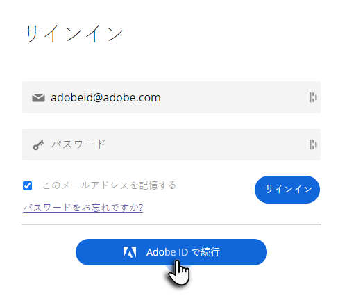

# Adobe ID を使用したユーザログイン {#user-sign-in-with-adobe-id}

Adobe ID を持つユーザが Marketo Engage アプリケーションにログインする必要がある場合、Marketo のログインページの通常のログインではなく、Adobe ID のログインリンクからログインする必要があります。リンクをクリックすると、ユーザは Marketo Engage アプリケーションに移動します。

1. Marketo ログインページの「**Adobe ID でログイン**」リンクをクリックします。

   

1. アドビの資格情報を入力し、「**続行**」をクリックします。

   

正常にログインすると、Marketo Engage アプリケーションに移動します。
