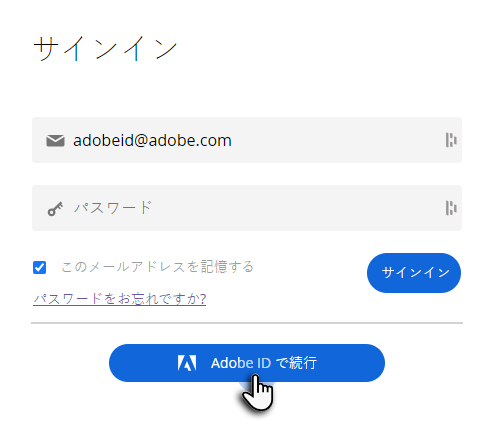
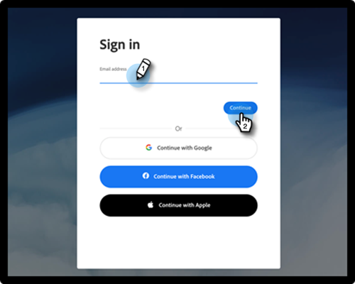

# Adobe ID を使用したユーザログイン {#user-sign-in-with-adobe-id}

Adobe ID を持つユーザが Marketo Engage アプリケーションにログインする必要がある場合、Marketo Engage のログインページの通常のログインではなく、Adobe ID のログインリンクからログインする必要があります。リンクをクリックすると、ユーザーは Marketo Engage アプリケーションに移動します。

1. Marketo Engage ログインページで「**[!UICONTROL Adobe ID で続行]**」をクリックします。

   

1. アドビの資格情報を入力し、「**[!UICONTROL 続行]**」をクリックします。

   

正常にログインすると、Marketo Engage アプリケーションに移動します。
