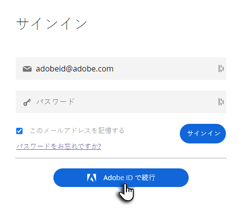

# Adobe ID を使用したユーザログイン {#user-sign-in-with-adobe-id}

Adobe IDを持つユーザーがMarketo Engage アプリケーションにログインする必要がある場合は、Marketo Engage ログインページの通常のログインではなく、Adobe ID ログインリンクを使用してログインする必要があります。 リンクをクリックすると、ユーザは Marketo Engage アプリに移動します。

1. Marketo Engage ログインページで「**[!UICONTROL Adobe ID で続行]**」をクリックします。

   

1. アドビの資格情報を入力し、「**[!UICONTROL 続行]**」をクリックします。

   

ログインが成功すると、Marketo Engage アプリケーションに移動します。
