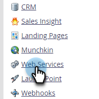

# Bulk Export API 情報 {#bulk-export-api-information}

過去 7 日間にMarketo Engage インスタンスによって [Bulk Extract API](https://experienceleague.adobe.com/ja/docs/marketo-developer/marketo/rest/bulk-extract/bulk-extract){target="_blank"} の処理能力がどの程度使用されたかを確認する方法を説明します。

>[!NOTE]
>
>追加の処理能力が必要な場合は、アカウント担当者にお問い合わせください。

1. 「**[!UICONTROL 管理者]**」領域に移動します。

   

1. 「**[!UICONTROL Web サービス]**」をクリックします。

   

1. 下にスクロールして、Bulk Export API 情報カードを表示します。「過去 7 日間」の横の数字をクリックすると、日別／API ユーザあたりの使用状況が表示されます。

   

   

>[!NOTE]
>
>Marketo Engage インスタンスの配分は、毎日午前 12:00 （CST）にリセットされます。
