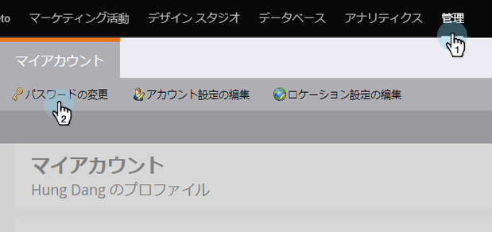

# マーケティング先のパスワードの変更{#change-your-marketo-password}

以下の簡単な手順に従って、Marketorのパスワードを変更します。

1. 任意のマーケティング担当者ユーザーが自分の名前をクリックし、**マイアカウント**&#x200B;をクリックします。

   

1. 管理者は、「**管理者**」をクリックし、「**パスワードの変更**」をクリックして管理者パスワードを変更することもできます。

   

1. 「古いパスワード」と「新しいパスワード」を入力し、新しいパスワードがすべての要件を満たしたら、「**保存**」をクリックします。

   

   秘密にしろ！ 安全に！

   >[!TIP]
   >
   >良いパスワードは？ 何か長い文字や数字、記号(「M@rk3to!$ Gre@t&quot;. ただ、あれじゃない。 クリエイティブになって自分で作りなさい。
