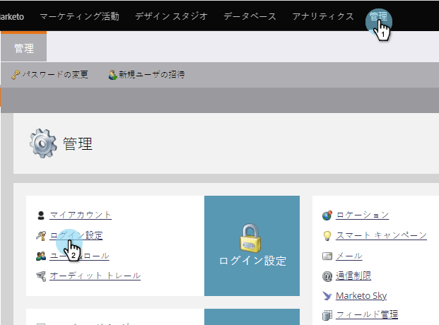
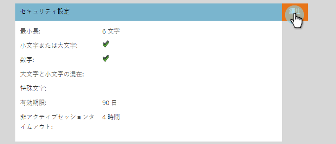
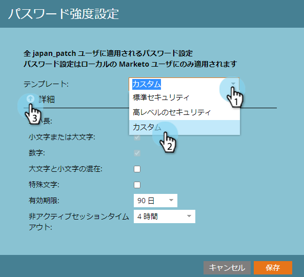
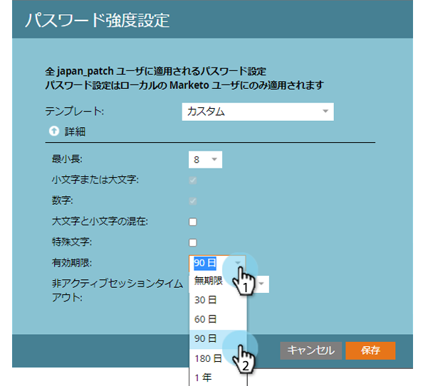
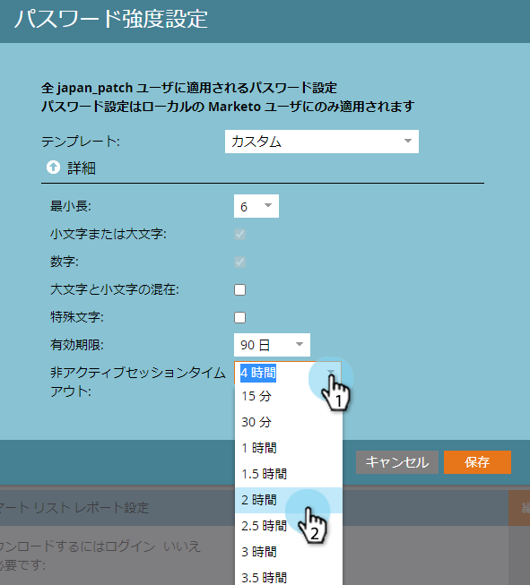

# パスワードセキュリティ設定の変更{#change-your-password-security-settings}

購読のパスワードポリシーを制御します。 これが方法です。

>[!NOTE]
>
>**必要な管理者権限**

1. 「**管理者**」で、「**ログイン設定**」をクリックします。

   

1. 「**セキュリティ設定**」で、「**編集**」をクリックします。

   

1. **テンプレート**&#x200B;を選択します。 アドバンスオプションについては、**アドバンス**&#x200B;ドロップダウンをクリックします。

   >[!NOTE]
   >
   >**定義**
   >
   >
   >テンプレートは、事前に構築された設定にすぎません。 標準は良い。 高いセキュリティが最も強い。 [カスタム]を使用すると、独自の作成が可能です。

   

   >[!TIP]
   >
   >**カスタム**&#x200B;のチェックボックスをオンにして、ユーザーがパスワードを作成する際に含める特性を指定します。

1. **有効期限**&#x200B;を設定します。** **この機能を使用すると、ユーザーは一定時間が経過した後にパスワードを自動的にリセットする必要があります。 これには管理者ユーザーも含まれます。

   >[!CAUTION]
   >
   >既存のユーザーには変更の通知は送信されません。 「**有効期限**」を「30日」に設定すると、全員が新しい設定に更新され、元のカデンスに戻ります。

   

1. **非アクティブセッションタイムアウト**&#x200B;を設定します。 これにより、ユーザーが非アクティブになってから、Marketorに再ログインするまでの時間を決定します。

   

   セキュリティは深刻なビジネスです。 お前の背中を取った。

