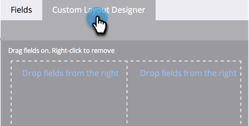

# ユーザーの詳細ページ用のカスタムタブの作成 {#creating-a-custom-tab-for-the-person-detail-page}

人物の詳細の特定のフィールドセットを何度も繰り返し探している場合は、状況をより簡単にするために、カスタムレイアウトの作成を検討してください。

1. 「**管理者**」領域に移動します。

   

1. 「**フィールド管理**」をクリックします。

   

1. 「**カスタムレイアウトデザイナー**」タブをクリックします。

   

1. 追加するフィールドを見つけ、キャンバスにドラッグ＆ドロップします。

   

1. 目的のレイアウトになるまで、引き続きフィールドを追加します。

   

   >[!NOTE]
   >
   >操作する列が 2 つあります。

   フィールドを削除する場合は、削除するフィールドを右クリックし、「**削除**」をクリックします。

   

   素晴らしいです。これで、人物の詳細を読み込む際に、カスタムレイアウトを使用して、重要な情報にアクセスできます。

   
