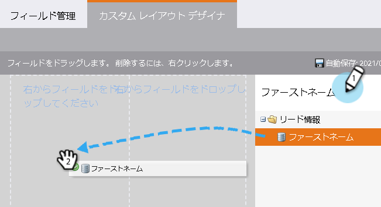
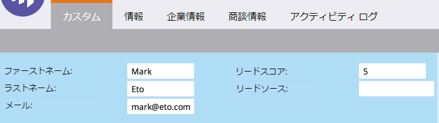

# 個人の詳細ページ用のカスタムタブの作成{#creating-a-custom-tab-for-the-person-detail-page}

個人の詳細を何度も繰り返し探している場合は、カスタムレイアウトを作成して作業を簡単にすることを検討してください。

1. **管理者**&#x200B;に移動し、**フィールド管理**&#x200B;をクリックします。

   

1. 「**カスタムレイアウトデザイナー**」タブをクリックします。

   

1. 追加するフィールドを見つけ、キャンバスにドラッグ&amp;ドロップします。

   

1. 希望のレイアウトになるまでフィールドの追加を続けます。

   

   >[!NOTE]
   >
   >操作する列が2つあります。

   フィールドを削除する場合は、削除するフィールドを右クリックし、「**削除**」をクリックします。

   

   すごい仕事！ これで、ユーザーの詳細を読み込むときに、カスタムレイアウトを使用して重要な情報にアクセスできます。

   
