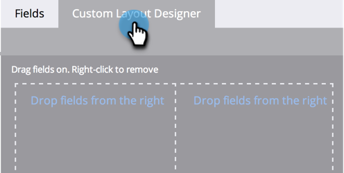

# ユーザーの詳細ページ用のカスタムタブの作成 {#creating-a-custom-tab-for-the-person-detail-page}

人物の詳細ページの特定のフィールドセットに頻繁にアクセスする必要がある場合は、カスタムレイアウトの作成を検討してください。

1. 「**[!UICONTROL 管理者]**」領域に移動します。

   

1. 「**[!UICONTROL フィールド管理]**」をクリックします。

   

1. 「**[!UICONTROL カスタムレイアウトデザイナー]**」タブをクリックします。

   

1. 追加するフィールドを見つけ、キャンバスにドラッグ＆ドロップします。

   

1. 目的のレイアウトになるまで、引き続きフィールドを追加します。

   

   >[!NOTE]
   >
   >操作する列が 2 つあります。

   フィールドを削除する場合は、削除するフィールドを右クリックし、「**[!UICONTROL 削除]**」をクリックします。

   

   ユーザーの詳細を読み込むと、カスタムレイアウトを使用して、重要な情報にアクセスできます。

   
