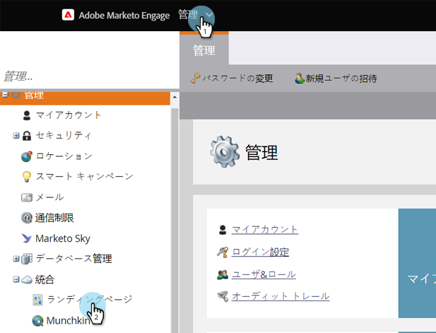
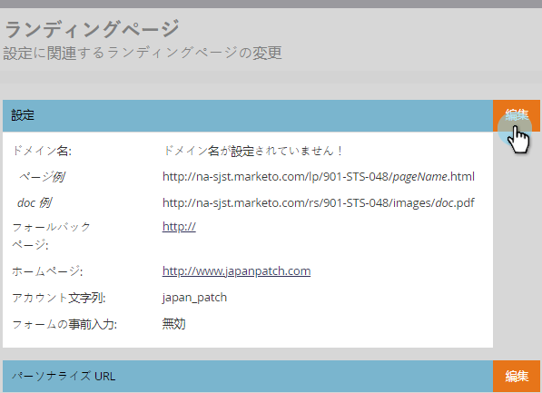

# CNAMEを使用したランディングページURLのカスタマイズ（管理） {#customize-your-landing-page-urls-with-a-cname-administration}

Marketoがランディングページをホストしている場合でも、URLは会社に合わせてカスタマイズする必要があります。

>[!NOTE]
>
>**例**
>
>No CNAME:
>
>http://na-sj02.marketo.com/lp/mktodemoaccount126/UnsubscribePage.html
>
>ブランドCNAME:
>
>http://go **YourCompany**.com/UnsuscribePage.html

>[!NOTE]
>
>**必要な管理者権限**

お前の準備を！

1. CNAMEの選択

   URLの前の部分です。 例：

   * **go**.YourCompany.com/NameOfPage.html
   * **info**.YourCompany.com/NameOfPage.html
   * **pages**.YourCompany.com/NameOfPage.html

   「(plus YourCompany.com)」という単語は「CNAME」と呼ばれます。 後で必要になるので、メモしてください。

1. アカウント文字列の検索
1. 「 **管理者** 」領域に移動し、「 **ランディングページ」をクリックします**。

   

1. 「**ランディングページ**」タブで、「設定」セクションから「アカウント文字列」をコピーします。

   

1. 後で必要になる場合もありますので、メモしてください。
1. リクエストをITに送信
1. ITスタッフに次のCNAMEを設定するように依頼します(「 [CNAME] 」と「 [ACCOUNT STRING] 」という単語を前の手順のテキストに置き換えます)。

   [CNAME].YourCompany.com > [ACCOUNT STRING].mktoweb.com

1. CNAMEの設定の完了
1. IT部門がCNAMEを作成したら、「 **管理者** 」に移動し、「 **ランディングページ**」をクリックします。

   

1. 「 **設定** 」セクションで、「 **編集**」をクリックします。

   

1. ランディングページの **ドメイン名にCNAMEを入力し、**&#x200B;フォールバックページを入力し **、ホームページを入力して、「**&#x200B;保存 **」をクリックし******&#x200B;ます。

   

   フォールバックページとは、Marketoランディングページが利用できない場合にユーザーがリダイレクトされるページです。
いい仕事！ これで、ランディングページに会社ドメインのブランドが付けられました。

