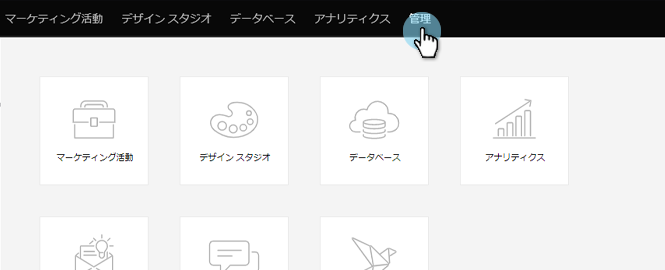
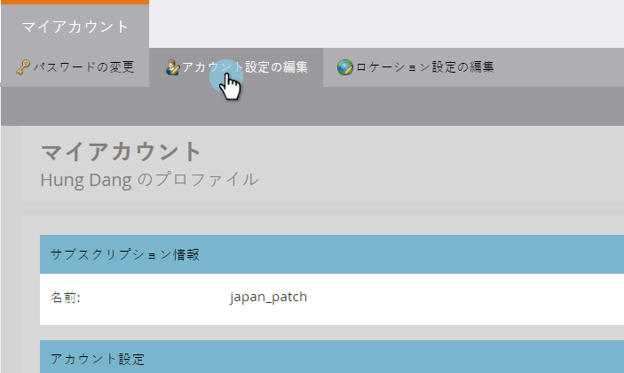
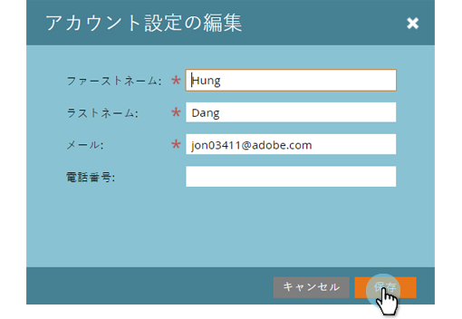

# アカウント設定の編集 {#edit-account-settings}

アカウントの電子メールアドレス、名前、または電話番号を変更する必要がありますか？ 以下の手順を説明します。

>[!NOTE]
>
>**必要な管理者権限**

1. **管理者**&#x200B;に移動します。

   

1. 「**マイアカウント**」を選択します。

   

1. 「**アカウント設定を編集**」を選択します。

   

1. 編集を行い、「**保存**」をクリックします。

   

   おい！ 情報が更新されました。
