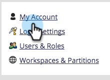

# アカウント設定の編集 {#edit-account-settings}

アカウントのメールアドレス、名前、電話番号を変更する必要がある場合、以下の手順に従います。

>[!NOTE]
>
>**管理者権限が必要**

1. 「**[!UICONTROL 管理者]**」領域に移動します。

   

1. 「**[!UICONTROL マイアカウント]**」を選択します。

   

1. 「**[!UICONTROL アカウント設定を編集]**」を選択します。

   

1. 編集を行い、「**[!UICONTROL 保存]**」をクリックします。

   
