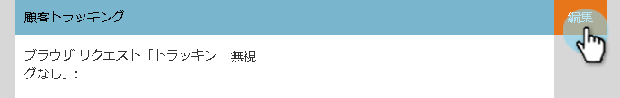
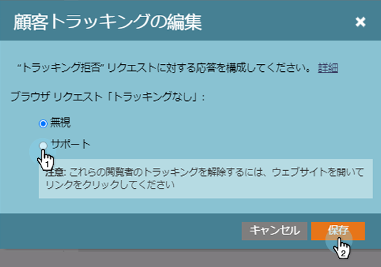

# 「追跡しない」ブラウザーサポート設定の編集 {#edit-do-not-track-browser-support-settings}

>[!NOTE]
>
>**FYI**
>
>Marketoは現在、すべての購読で言語を標準化しているので、購読およびdocs.marketo.comの人物/人物にリード/リードを表示できます。 これらの用語は同じことを意味し、記事の説明には影響しません。 他にも変化がある。 [詳細情報](http://docs.marketo.com/display/DOCS/Updates+to+Marketo+Terminology)。

「追跡しない」は、Marketoなどのシステムで追跡されないブラウザーリクエストです。 次の手順に従って、そのリクエストを受け入れることができます。

>[!NOTE]
>
>**必要な管理者権限**

>[!NOTE]
>
>「追跡しない」は、デフォルトで「無視」に設定されるので、必要に応じて手順を実行する必要はありません。

1. [**管理者**]をクリックします。

   

1. [ **マンチキン**]をクリックします。

   

1. 「 **個人追跡**」で、「 **編集**」をクリックします。

   

1. 「 **Support** 」を選択し、「 **保存**」をクリックします。
1. 

   変更を保存すると、更新が表示されます。

   

   >[!NOTE]
   >
   >ベストプラクティスは、「追跡しない」機能をサポートすることです。 ヨーロッパでは法律だ！

   >[!TIP]
   >
   >「追跡しない」とその仕組みについて詳しくは、 [このページを参照してください](https://en.wikipedia.org/wiki/Do_Not_Track)。

