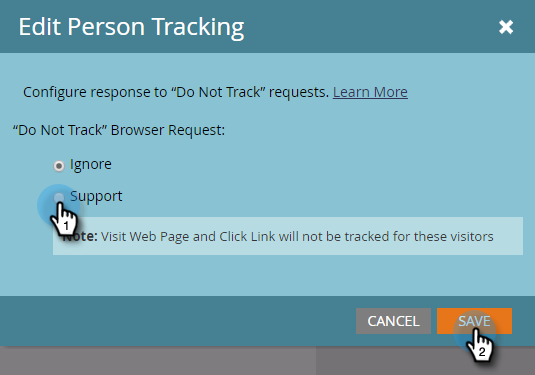

# 「トラックしない」ブラウザーのサポート設定の編集 {#edit-do-not-track-browser-support-settings}

「トラックしない」は、Marketo などのシステムでトラックされないためのブラウザーリクエストです。 次の手順でリクエストに従うことができます。

>[!NOTE]
>
>**管理者権限が必要**

>[!NOTE]
>
>「トラッキングしない」はデフォルトで&#x200B;**[!UICONTROL Ignore]**&#x200B;に設定されるので、希望する場合は、手順を実行する必要はありません。

1. 「**[!UICONTROL 管理者]**」をクリックします。

   

1. 「**[!UICONTROL Munchkin]**」をクリックします。

   

1. 「**[!UICONTROL 人物のトラッキング]**」をクリックし、「**[!UICONTROL 編集]**」をクリックします。

   

1. 「**[!UICONTROL サポート]**」を選択して、「**[!UICONTROL 保存]**」をクリックします。

   

   変更を保存すると、更新が表示されます。

   

   >[!NOTE]
   >
   >ベストプラクティスは、「トラックしない」機能をサポートすることです。 ヨーロッパでは、それが法律です。

   >[!TIP]
   >
   >「トラッキングしない」とその仕組みについて詳しくは、[このページ ](https://en.wikipedia.org/wiki/Do_Not_Track)を参照してください。
