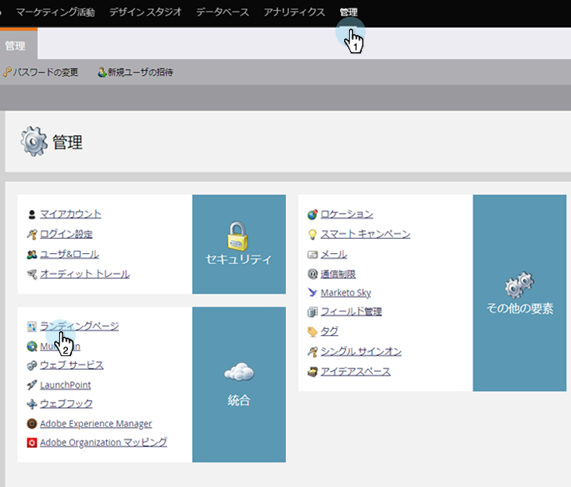
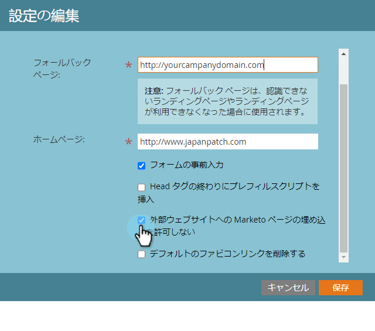

# ランディングページ設定の編集{#edit-landing-page-settings}

ドメイン名とフォールバックページの編集、フォームの事前入力の有効/無効、ランディングページの誤用の防止などが可能です。 これが方法です。

>[!NOTE]
>
>**必要な管理者権限**

1. 「**管理者**」で、「**ランディングページ**」をクリックします。

   

1. 「**ランディングページ**」セクションで、「**編集**」をクリックします。

   

1. ドメインとページ情報を入力します。

   | 用語 | 定義 |
   |---|---|
   | ランディングページのドメイン名 | これはCNAMEです。 CNAMEは、ランディングページにユーザーに提供するURLの最初の部分です。 例えば、`http://go.yourCompany.com`では「go」という単語がCNAMEです。 複数を持つことはできますが、ほとんどの人は1つだけを使用します。 |
   | フォールバックページ | ランディングページが存在しない場合やダウンした場合は、ここに移動します。 [フォールバックページ](/help/marketo/product-docs/administration/settings/set-a-fallback-page.md)の詳細を表示します。 |
   | ホームページ | 会社サイトのURLを入力します。 |

   

1. フォームが既知の（cookieを使用した）人々の情報を事前入力できるようにするには、「**フォームの事前入力**」チェックボックスをオンにします。 ブロックする場合はオフにします。

   

1. 悪質なサイトがコンテンツを一見ホストしているように見えないようにしたい場合は、[**マーケティングページを外部のWebページに埋め込まないようにする**]チェックボックスをオンにします。

   

   >[!NOTE]
   >
   >事前入力`<script>`タグをコード内の`<head>`タグの末尾に表示する場合は、「**ヘッドの末尾に事前入力スクリプトを挿入**」ボックスをオンにします。 最初に表示する場合は、チェックボックスをオフにします。
   >
   >「**既定のお気に入りリンク**&#x200B;を削除」をオンにすると、マーケティング担当者がお気に入りリンクをコードに挿入できなくなります。

1. 選択を行ったら、「**保存**」をクリックします。

   

   素晴らしい仕事！ これで、ランディングページに適切な情報が提供され、開始はすぐに機能するはずです。
