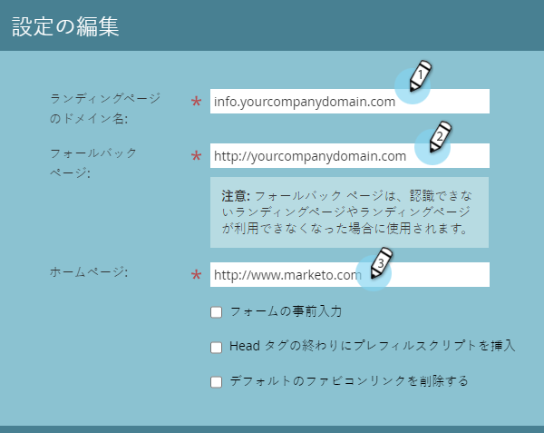
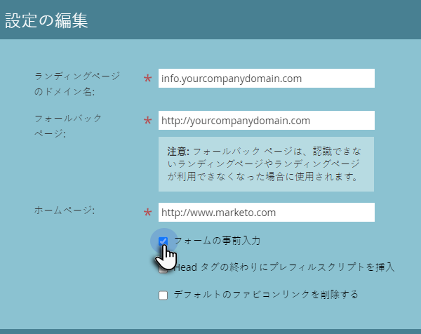
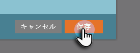

# ランディングページ設定を編集する {#edit-landing-page-settings}

ドメイン名とフォールバックページの編集、フォームの事前入力の有効化や無効化、ランディングページの誤用の防止などをおこなうことができます。手順は以下のとおりです。

>[!NOTE]
>
>**管理者権限が必要**

1. 「**管理者**」領域に移動します。

   

1. 「**ランディングページ**」をクリックします。

   

1. **ランディングページ**&#x200B;セクションで、「**編集**」ボタンをクリックします。

   

1. ドメインとページ情報を入力します。

   

   | 用語 | 定義 |
   |---|---|
   | ランディングページのドメイン名 | これは CNAME です。CNAME は、ランディングページの訪問者に与える URL の最初の部分です。例えば、`https://go.yourCompany.com` の場合、「go」が CNAME です。複数を使用できますが、ほとんどのユーザーは 1 つのみを使用します。 |
   | フォールバックページ | ランディングページが存在しないか停止している場合に表示するページです。詳細については、「[フォールバックページ](/help/marketo/product-docs/administration/settings/set-a-fallback-page.md)」を参照してください。 |
   | ホームページ | 企業サイトの URL を入力します。 |

1. 「**フォームの事前入力**」チェックボックスをオンにすると、既知の（Cookie が保存されている）リードに関する情報をフォームに事前入力できます。ブロックする場合はオフにします。

   

1. 悪意のあるサイトがコンテンツを一見ホストしているように見えるのを防ぐには、「**外部の Web ページに Marketo ページの埋め込みを許可しない**」チェックボックスをオンにします。

   

   >[!NOTE]
   >
   >`<script>` タグをコードの `<head>` タグの最後に事前入力する場合は、「**Head の最後に Script を事前挿入**」ボックスをオンにします。最初に表示する場合は、オフのままにします。
   >
   >「**デフォルトの Favicon リンクを削除**」をオンにして、Marketo が Favicon リンクをコードに挿入しないようにします。

1. 選択後に、「**保存**」をクリックします。

   

   完成です。これで、ランディングページに適切な情報が表示され、すぐに作業を開始できます。
