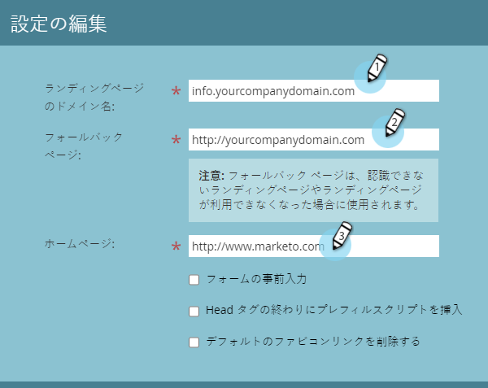
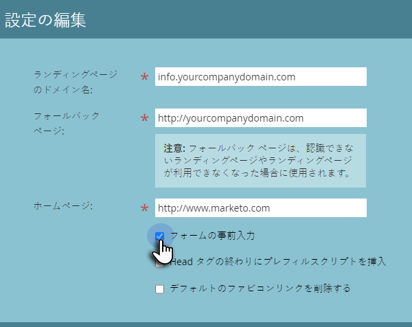
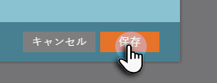

# ランディングページ設定の編集 {#edit-landing-page-settings}

ドメイン名とフォールバックページの編集、フォームの事前入力の有効化や無効化、ランディングページの誤用の防止などを行うことができます。 次の手順に従います。

>[!NOTE]
>
>**管理者権限が必要**

1. 「**[!UICONTROL 管理者]**」領域に移動します。

   

1. 「**[!UICONTROL ランディングページ]**」をクリックします。

   

1. **[!UICONTROL ランディングページ]**&#x200B;セクションで、「**[!UICONTROL 編集]**」ボタンをクリックします。

   

1. ドメインとページ情報を入力します。

   

   | 用語 | 定義 |
   |---|---|
   | [!UICONTROL ランディングページのドメイン名] | これは、あなたの CNAME です。 CNAME は、ランディングページの訪問者に与える URL の最初の部分です。 例えば、`https://go.yourCompany.com` の場合、「go」が CNAME です。 複数のフィールドを使用することもできますが、ほとんどの人は1つしか使用しません。 |
   | [!UICONTROL フォールバックページ] | ランディングページが存在しない、またはダウンしている場合は、ここに移動します。 詳しくは、[フォールバックページ](/help/marketo/product-docs/administration/settings/set-a-fallback-page.md)を参照してください。 |
   | [!UICONTROL ホームページ] | 企業サイトの URL を入力します。 |

1. 「**[!UICONTROL フォームの事前入力]**」チェックボックスをオンにすると、既知の（Cookie が保存されている）リードに関する情報をフォームに事前入力できます。 ブロックする場合はオフにします。

   

   >[!NOTE]
   >
   >`<script>` タグをコードの `<head>` タグの最後に事前入力する場合は、「**[!UICONTROL Head の最後に Script を事前挿入]**」ボックスをオンにします。 最初に表示する場合は、オフのままにします。
   >
   >「**[!UICONTROL デフォルトの Favicon リンクを削除]**」をオンにして、Marketo が Favicon リンクをコードに挿入しないようにします。

1. 選択したら、「**[!UICONTROL 保存]**」をクリックします。

   

   これでランディングページに適切な情報が表示されるので、すぐに作業を開始する必要があります。
