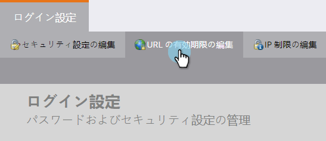

# レポートとアラートのリンク有効期限の編集 {#edit-link-expiration-in-reports-and-alerts}

レポート配信登録メール内のリンクは、3 日後に有効期限が切れます。これらのリンクの有効期限を変更するには、次の手順に従います。

>[!NOTE]
>
>**管理者権限が必要**

1. 「**管理者**」で「**ログイン設定**」をクリックします。

   

1. 「**URL の有効期限の編集**」

   

1. ドロップダウンで、リンクの有効期限が切れるまでの日数を選択します。「**保存**」をクリックします。

   

>[!IMPORTANT]
>
>この設定は、レポートおよびアラート内のリンクにのみ適用されます。メールによる[ダウンロードレポート](/help/marketo/product-docs/reporting/basic-reporting/report-subscriptions/subscribe-to-a-smart-list.md#email-message)リンクまたはマーケティングメールには&#x200B;**適用されません**。
