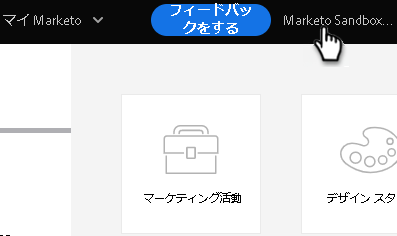
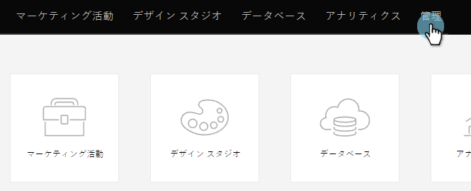
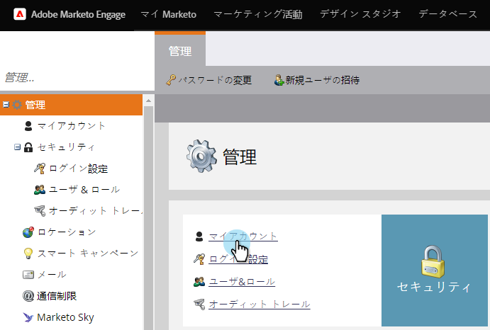
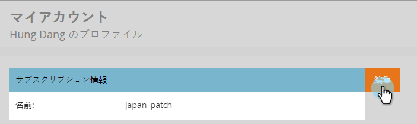
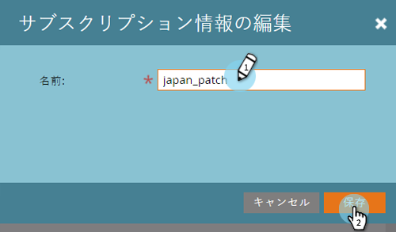

# サブスクリプション設定の編集 {#edit-subscription-settings}

複数の Marketo サブスクリプションへのアクセス権があり、どれを使用しているかを確認したい場合は、それぞれに一意の名前を付けてみてください。その名前がサブスクリプションページの上部に表示されます。

例えば、実稼動とサンドボックスの両方のインスタンスで作業する場合、1 つのサブスクリプションに **Marketo Production**、もう 1 つに **Marketo Sandbox** と名前を付けることができます。

1. 「**管理者**」に移動します。

   

1. 「**マイアカウント**」をクリックします。

   

1. 「**サブスクリプション情報を編集**」をクリックします。

   

1. 編集を行い、「**保存**」をクリックします。

   

   完了です。サブスクリプションに新しい名前が設定されます。
