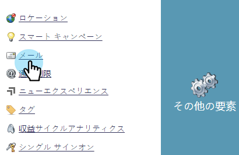
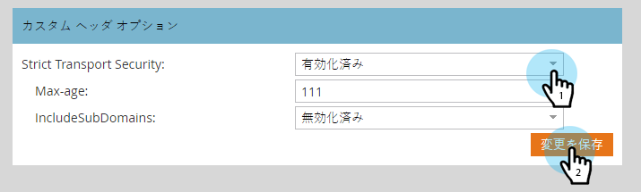

# メール追跡リンクヘッダー {#email-tracking-link-headers}

以下の手順に従って、電子メールトラッキングリンクヘッダーをカスタマイズします。

1. Marketo で、「**管理者**」をクリックします。

   

1. 「**メール**」をクリックします。

   

1. 下にスクロールして「Custom Header Options」を表示します。 目的の設定を選択し、 **変更を保存**.

   

<table>
 <tr>
  <td><strong>Strict-Transport-Security</strong></td>
  <td>ランディングページへの接続が常に HTTPS 経由で提供されることを保証するには、これを使用します（SSL で保護されたランディングページを含むサブスクリプションに対してのみ設定する必要があります）。</td>
 </tr>
</table>

>[!CAUTION]
>
>これらの設定を IT チームと確認して、組織のポリシーをどのように設定するかを決定することが重要です。設定が正しくないと、一部の訪問者が電子メールリンクにアクセスできなくなる可能性があります。
