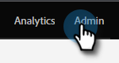
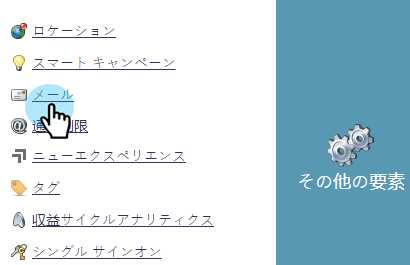
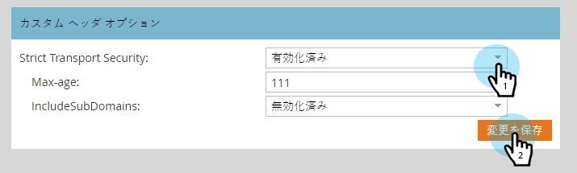

# メールトラッキングリンクのヘッダー {#email-tracking-link-headers}

以下の手順に従って、メールトラッキングリンクのヘッダーをカスタマイズします。

1. Marketo で、「**[!UICONTROL 管理者]**」をクリックします。

   

1. 「**[!UICONTROL メール]**」をクリックします。

   

1. 下にスクロールして「カスタムヘッダーオプション」を表示します。 目的の設定を選択し、完了したら「**[!UICONTROL 変更を保存]**」をクリックします。

   

<table>
 <tr>
  <td><strong>Strict-Transport-Security</strong></td>
  <td>トラッキングリンクが常に HTTPS 経由で提供されることを保証するには、これを使用します（SSL で保護されたトラッキングリンクを含むサブスクリプションに対してのみ設定する必要があります）。</td>
 </tr>
</table>

>[!CAUTION]
>
>これらの設定をIT部門と確認して、組織のポリシーを決定することが重要です。 設定が正しくないと、一部の訪問者がメールリンクにアクセスできなくなる可能性があります。
