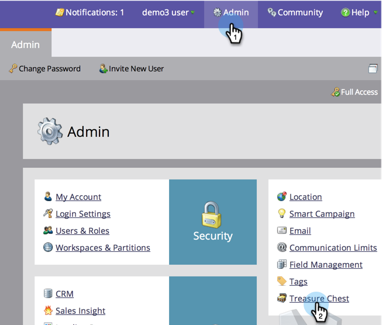

# 宝箱機能の有効化/無効化 {#enable-or-disable-treasure-chest-features}

宝箱には、完全にはサポートされていない、楽しい実験機能が入っている。

>[!NOTE]
>
>**必要な管理者権限**

1. 「**管理者**」で「 **宝箱**」をクリックします。

   

1. 有効または無効にする機能の **編集** (Edit)をクリックします。

   

1. 有効にするには **有効** ・チェックボックスをオンにし、無効にするにはオフにし、 **保存をクリックします**。

   

   >[!TIP]
   >
   >
   >変更が反映されるようにするには、ログアウトしてからMarketingに戻す必要がある場合があります。

