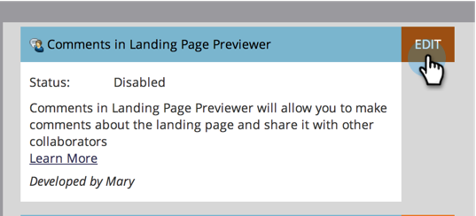

# アイデアスペースの機能を有効または無効にする {#enable-or-disable-treasure-chest-features}

アイデアスペースは、完全にはサポートされていない楽しい実験機能を保持しています。

>[!NOTE]
>
>**管理者権限が必要**

1. 「**[!UICONTROL 管理者]**」領域に移動します。

   

1. **[!UICONTROL アイデアスペース]**&#x200B;をクリックします。

   

1. 有効または無効にする機能の「**[!UICONTROL 編集]**」をクリックします。

   

1. 有効にする場合は「**[!UICONTROL 有効化]**」ボックスにチェックをつけ、無効にする場合はチェックを外してます。その後、「**[!UICONTROL 保存]**」をクリックします。

   

   >[!TIP]
   >
   >変更が有効になるように、場合によっては、ログアウトしてから Marketo に戻る必要があります。
