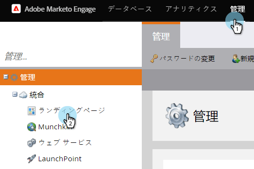
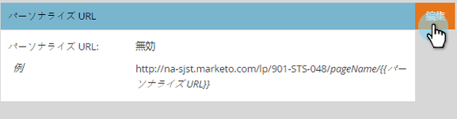

# アカウントに対してパーソナライズされたURLを有効にする（管理） {#enable-personalized-urls-for-your-account-administration}

パーソナライズされたURLは、印刷物のメールキャンペーンに最適です。

>[!NOTE]
>
>**必要な管理者権限**

1. 「**管理者**」に移動し、「 **ランディングページ**」をクリックします。

   

1. 「 **編集**」をクリックします。

   

1. 「パーソナライズしたURLを **有効にする** 」ボックスをオンにし、「 **S***ave**」をクリックします。

   

素晴らしい仕事！ アカウントでPURLを有効にしたので、個々のランディングページに対してPURLを [有効にすることができます](../../../product-docs/demand-generation/landing-pages/personalizing-landing-pages/enable-personalized-urls-for-a-landing-page.md)。

>[!NOTE]
>
>姓と名が同じ人が2人いる場合は、末尾に自動的に番号が追加されます。

