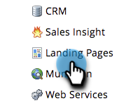

# アカウントでパーソナライズ URL を有効にする {#enable-personalized-urls-for-your-account}

パーソナライズ URL は、招待状を郵送するなど紙媒体のキャンペーンをおこなうのに適しています。

>[!NOTE]
>
>**管理者権限が必要**

1. 「**管理者**」領域に移動します。

   

1. 「**ランディングページ**」をクリックします。

   

1. 「**編集**」をクリックします。

   

1. 「**パーソナライズ URL を有効にする**」ボックスのチェックをオンにして、「**保存**」をクリックします。

   

完成です。アカウントで PURL が有効になったので、[個々のランディングページで有効にできます](/help/marketo/product-docs/demand-generation/landing-pages/personalizing-landing-pages/enable-personalized-urls-for-a-landing-page.md)。

>[!NOTE]
>
>同姓同名の人物が 2 人いる場合、システムは自動的に末尾に数字を追加します。
