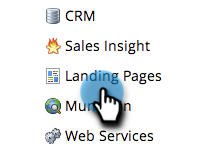

# アカウントでパーソナライズ URL を有効にする {#enable-personalized-urls-for-your-account}

パーソナライズされたURLは、印刷メール施策に役立ちます。

>[!NOTE]
>
>**管理者権限が必要**

1. 「**[!UICONTROL 管理者]**」領域に移動します。

   

1. 「**[!UICONTROL ランディングページ]**」をクリックします。

   

1. 「**[!UICONTROL 編集]**」をクリックします。

   

1. 「**[!UICONTROL パーソナライズ URL を有効にする]**」ボックスのチェックをオンにして、「**[!UICONTROL 保存]**」をクリックします。

   

アカウントで PURL が有効になったので、[個々のランディングページで有効にできます](/help/marketo/product-docs/demand-generation/landing-pages/personalizing-landing-pages/enable-personalized-urls-for-a-landing-page.md)。

>[!NOTE]
>
>同姓同名の人物が 2 人いる場合、システムは自動的に末尾に数字を追加します。
