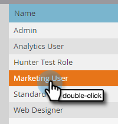

# グローバルフォーム検証ルール {#global-form-validation-rules}

この機能を使用すると、特定のドメインがドメインフォームに送信されるのを Marketo Engage でブロックできます。

## アクセスを有効にする方法 {#how-to-enable-access}

この機能を利用する前に、目的のロールに応じて権限を有効にする必要があります。

1. Marketo で、「**[!UICONTROL 管理者]**」をクリックします。

   

1. 「**[!UICONTROL ユーザ＆ロール]**」をクリックします。

   

1. 「**[!UICONTROL ロール]**」タブをクリックします。

   

1. 権限を付与するロールをダブルクリックします。

   

1. 「管理者にアクセス」の横の「**+**」記号をクリックします。

   

1. 下にスクロールして、「**[!UICONTROL フォーム検証ルールにアクセス]**」を選択し、「**[!UICONTROL 保存]**」をクリックします。

   

## 新規フォーム検証ルールの作成 {#create-new-form-validation-rule}

>[!IMPORTANT]
>
>これらのルールは、Marketo Engage サブスクリプション内のすべてのフォームに適用されます。

1. Marketo で、「**[!UICONTROL 管理者]**」をクリックします。

   

1. 「**[!UICONTROL グローバルフォーム検証ルール]**」をクリックします。

   

1. 「**[!UICONTROL 新規フォームの検証ルール]**」をクリックします。

   

   >[!NOTE]
   >
   >「フォーム検証ルールのアクション」ドロップダウンを使用して、既存のルールを削除または編集できます。

1. ルールに名前を付け、オプションの説明を入力し、フォーム訪問者に表示するエラーメッセージを入力します。ブロックするドメインを「ルール」ボックスに入力し、「**[!UICONTROL ルールをアクティブ化]**」を選択し、「**[!UICONTROL 作成]**」をクリックします。

   

>[!NOTE]
>
>Marketo Engage には、あらかじめ用意された「消費者向けメールドメインブロックリスト」ルールを使用する際にブロックされる、無料の消費者向けメールドメインのブロックリストが定義されています。[リスト表示はこちら](/help/marketo/product-docs/administration/settings/assets/freemaildomains.csv)。

## フォームごとのアクセスを無効にする方法{#how-to-disable-access-per-form}

有効にすると、ルールはすべてのフォームに適用されます。ただし、特定の要件を持つフォームがあり、何も拒否したくない場合は、無効にできます [!UICONTROL グローバルフォーム検証ルール] 」と入力します。

1. 目的のフォームで、「**[!UICONTROL フォーム設定]**」をクリックし、「**[!UICONTROL 設定]**」をクリックします。

   

1. 次をクリック： **[!UICONTROL グローバルフォーム検証ルール]** ドロップダウンで「 」を選択します。 **[!UICONTROL 無効]**.

   

フォームを承認して投稿すると、フォームは無視されます [!UICONTROL グローバルフォーム検証ルール].
