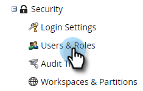

# グローバルフォーム検証ルール {#global-form-validation-rules}

この機能を使用すると、特定のドメインがドメインフォームに送信されるのをMarketo Engageでブロックできます。

## アクセスを有効にする方法 {#how-to-enable-access}

この機能を利用する前に、目的の役割に応じて権限を有効にする必要があります。

1. Marketo で、「**管理者**」をクリックします。

   

1. 「**ユーザーと役割**」をクリックします。

   

1. 次をクリック： **役割** タブをクリックします。

   

1. 権限を付与する役割をダブルクリックします。

   

1. 次をクリック： **+** 「管理者にアクセス」の横に「 」を入力します。

   

1. 下にスクロールして、「 」を選択します。 **フォーム検証ルールにアクセス** をクリックし、 **保存**.

   

## 新規フォーム検証ルールの作成 {#create-new-form-validation-rule}

>[!IMPORTANT]
>
>これらのルールは、Marketo Engage購読内のすべてのフォームに適用されます。

1. Marketo で、「**管理者**」をクリックします。

   

1. クリック **グローバルフォーム検証ルール**.

   

1. クリック **新規フォームの検証ルール**.

   

   >[!NOTE]
   >
   >フォーム検証ルールのアクションドロップダウンを使用して、既存のルールを削除または編集できます。

1. ルールに名前を付け、オプションの説明を入力し、フォーム訪問者に表示するエラーメッセージを入力します。 ブロックするドメインを [ ルール ] ボックスに入力し、[ **ルールをアクティブ化**&#x200B;をクリックし、 **作成**.

   
