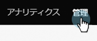
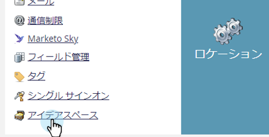

# スパムフォームの送信をブロックする方法{#how-to-block-spam-form-submissions}

多くの場合、チェックサムが無効であるか、チェックサムが見つからないフォーム送信（通常はボットから）は、誤った統計を生成できます。 それを防ぐ方法を次に示します。

>[!CAUTION]
>
>この機能は、プログラム的なPOSTを使用して行われたフォーム送信をleadCapture/save2エンドポイントに拒否します。 ビジネスで、フォームをその方法でMarketoに送信する統合を利用している場合、この機能を有効にすると、それらの送信がブロックされます。 leadCapture/save2をAPIとして使用したり、プログラムによるフォーム送信を直接実行したりすることは、サポートされていません。 次を使用して、ビジネスでフォームのみが送信されるようにしてください。フォームアセット、埋め込みフォームコード、Forms2.js API、または送信フォームREST API。

1. 「**管理者**」をクリックします。

   

1. **宝箱**&#x200B;をクリックします。

   

1. 「**人物キャプチャ — 無効なチェックサム値を拒否**」の横にある「**編集**」をクリックします。

   

1. 「**有効**」チェックボックスを選択し、「**保存**」をクリックします。

   

>[!NOTE]
>
>この機能を有効にすると、誤った数値が除外されるので、フォームのアクティビティが低下する場合があります。
